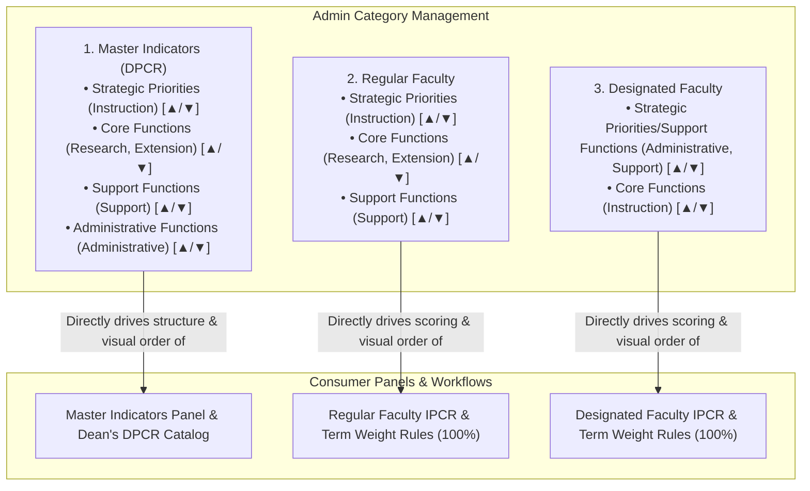
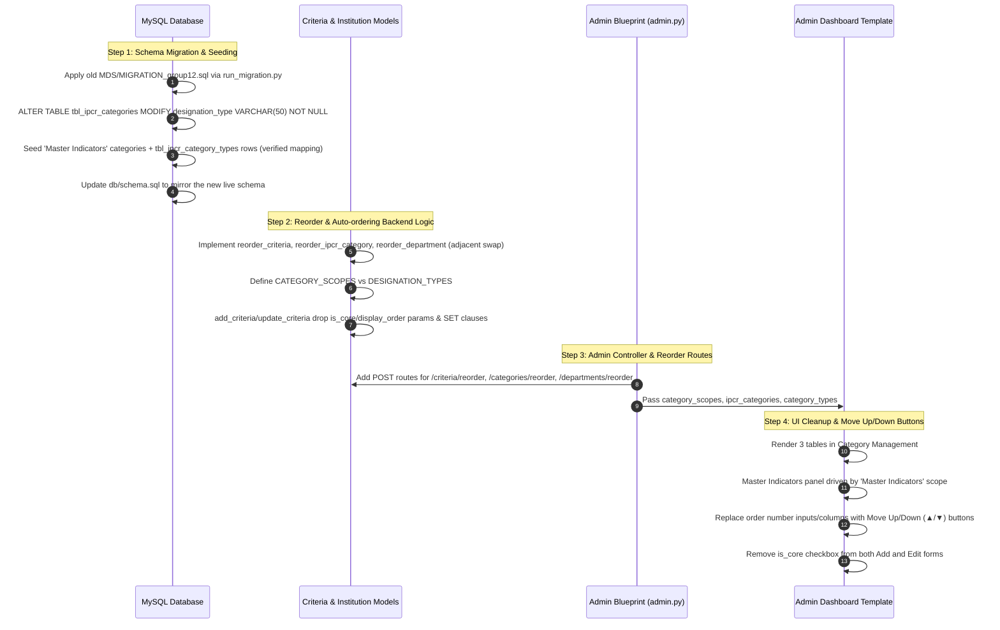

# Category Management Scope Expansion & Frontend Simplification Implementation Plan (with Move Up/Down Reordering)

> **Revision note**: This is a corrected version of the original plan. It was checked against the
> live codebase (`app/models/criteria.py`, `app/routes/admin.py`, `app/templates/admin_dashboard.html`,
> `db/schema.sql`) and against the shared MySQL database itself. Two substantive errors in the
> original draft are fixed here — see **§0 Corrections** below before implementing.

---

## 0. Corrections From the Original Draft

1. **The category → target-type mapping was reversed.** The original draft's seed data and
   diagram put Research/Extension under "Strategic Priorities" and Instruction under "Core
   Functions" for the Regular Faculty structure. A live query against `tbl_ipcr_categories` /
   `tbl_ipcr_category_types` on the shared database shows the actual mapping is the opposite:

   | designation_type | ipcr_category | target types |
   |---|---|---|
   | Regular Faculty | **Strategic Priorities** | A. Instructions |
   | Regular Faculty | **Core Functions** | A. Research, B. Extension Services/Training/Advisory |
   | Regular Faculty | **Support Functions** | Support Functions |
   | Designated Faculty | **Strategic Priorities/Support Functions** | Administrative Function, Support Functions |
   | Designated Faculty | **Core Functions** | A. Instructions |

   This matches CLAUDE.md's own callout ("Instruction is Strategic Priorities for Regular Faculty
   but Core Functions for Designated Faculty") and `old MDS/CHANGELOG_scoring_categories.md`. The
   seed data in §2A below has been corrected to match this verified mapping. (The live DB also has
   some leftover test rows — an "Innovation" category on both scopes and a duplicate "Support
   Functions (added for testing)" on Designated Faculty — that are pre-existing clutter unrelated
   to this plan and are left untouched.)

2. **`is_core` is load-bearing, not just a confusing checkbox — flagged, then accepted as a
   trade-off.** `tbl_target_categories.is_core` distinguishes structured, CHAIR/RET-routed target
   types from free-form ones (the "Custom Target Items (non-core)" type). It's read directly in
   review-completion logic in `app/routes/prog_chair.py:250-252,285-287`, `app/models/designated.py`,
   and `app/models/dean.py` — e.g. `OR (tc.is_core = 0 AND dt.proposed_quantity > 0)` lets a
   non-core target skip the structured-review quantity check that core targets require. **Decision:**
   for simplicity, `is_core` is removed from both the Add and Edit criteria forms and defaults to
   `1` for every criterion created going forward. This is a deliberate, accepted trade-off — it
   means the admin UI can no longer create another free-form/non-core type like the existing
   "Custom" one. The existing non-core row(s) already in `tbl_target_categories` are untouched and
   keep working exactly as today; only *future* criterion creation is affected. `update_criteria`
   still must not touch `display_order` on an edit (see §2B.3) — that part of the original
   correction stands regardless of the `is_core` decision.

Everything else in the original plan — the problem statement, the reorder-by-adjacent-swap design,
the `display_order` auto-assignment, and the overall 3-table/3-scope architecture — checked out
against the code and is kept as originally proposed.

---

## Executive Summary
This plan details the architectural and UI enhancements to:
1. **Unify Category Management with a 3-Scope Model**: Extend the existing shared category
   table (`tbl_ipcr_categories`) with a third scope for **Master Indicators**, alongside the
   existing **Regular Faculty** and **Designated Faculty** scopes. (Not a new physical table — see
   §2A; `designation_type` widens from a 2-value ENUM to a free string so a third scope value fits.)
2. **Eliminate the Master Indicators Panel Hack**: Replace the current workaround where Master
   Indicators borrowed Regular Faculty's category grouping (which left Administrative Functions in
   an awkward "Other Target Types" bottom box) with direct rendering from the Master Indicators
   category configuration.
3. **Replace Raw Numeric `display_order` with Intuitive Move Up / Down (▲ / ▼) Controls**: Remove
   manual numeric inputs from all creation/edit forms. Reordering is handled via one-click Move
   Up / Move Down buttons on table rows with backend adjacent-swap logic.
4. **Remove the Frontend `is_core` Field**: Eliminate the `is_core` checkbox from both the Add and
   Edit Target Types forms, setting `is_core = 1` by default for all newly created target types
   (accepted trade-off — see §0.2).

---

## Scope & Impact — What This Change Touches

Confirmed purpose: the new **Master Indicators** scope inside Category Management exists to
manage *which categories exist and which target types are grouped under them for display on the
Master Indicators panel* — nothing more. Tracing every place `tbl_ipcr_categories` /
`tbl_ipcr_category_types` are read (`app/models/scoring.py`, `app/models/ipcr_form.py`,
`app/routes/admin.py`, `app/routes/dean.py`, `app/templates/dean_dashboard.html`) confirms the
blast radius is narrower than the original draft's diagram implied.

**Directly affected:**
* **`tbl_ipcr_categories` / `tbl_ipcr_category_types`** — gains new rows scoped to
  `'Master Indicators'` (purely additive; no existing Regular/Designated Faculty rows change).
* **Admin Dashboard → Category Management (`#nav-categories`)** — gains a third management table
  and a third value in the Add/Edit Category modal's scope selector.
* **Admin Dashboard → Master Indicators panel (`#nav-indicators`)** — its grouping/rendering
  switches from the hardcoded `dpcr_dt = 'Regular Faculty'` + "Other Target Types" fallback to the
  new `'Master Indicators'` scope. This is the one user-facing screen the feature is actually for.
* **Admin routes** (`app/routes/admin.py`) — `admin_dashboard`, `admin_save_category`, and the new
  reorder endpoints.

**Not affected (verified, not assumed):**
* **Faculty/Chair/Dean scoring and weight rules** (`app/models/scoring.py`, `tbl_criteria_weights`)
  — every caller resolves a concrete `Regular Faculty`/`Designated Faculty` designation before
  querying `tbl_ipcr_categories`; `'Master Indicators'` rows are structurally unreachable from
  those code paths.
* **`tbl_master_indicators` (the actual indicator rows admins create/edit/delete)** — these key off
  `category_id` → `tbl_target_categories` (the target-*type* level: Instruction, Research, etc.),
  never off `ipcr_category_id`. Changing which `ipcr_category` a type is grouped under changes only
  which card an indicator's row appears under on the panel — it does not move, rename, or alter any
  indicator data.
* **Dean's DPCR/cascading view** (`app/templates/dean_dashboard.html:174`) — despite the original
  draft's diagram claiming this feature "drives" Dean's catalog too, Dean's page uses its own
  independent, hardcoded string-matching (`'Instruction' in indicator.category_name or 'Strategic'
  in indicator.category_name`) to label groups. It does not read `tbl_ipcr_categories` at all, so
  it is untouched by this change either way.
* **Faculty/Program Chair/RET Chair submission and review flows** — these route on
  `tbl_target_categories.review_lane`/`is_core` and on `tbl_committed_targets`/`tbl_draft_targets`,
  none of which reference `ipcr_category_id`.
* **Printed IPCR** (`app/models/ipcr_form.py`) — resolves `Regular Faculty`/`Designated Faculty`
  explicitly, same as scoring.

---

## 1. Problem Statement & Architecture Comparison

### Current Architecture & Gotchas
* **Master Indicators Panel**: Currently hardcodes `dpcr_dt = 'Regular Faculty'`
  (`app/templates/admin_dashboard.html:1278`). Target types not assigned to Regular Faculty's
  structure (i.e. *Administrative Functions*, which today is only mapped under Designated
  Faculty) fall through to an "Other Target Types" card at the bottom of the page
  (`admin_dashboard.html:1364-1432`).
* **`is_core` Ambiguity**: Both the Add and Edit Criterion forms expose an `is_core` checkbox
  admins do not understand the purpose of, creating risk of breaking review routing if toggled
  incorrectly. Removed per §0.2 as an accepted trade-off — new criteria always default to core.
* **`display_order` Clutter & Frustration**: Every creation/edit modal (Criteria, Categories,
  Departments) requires typing an arbitrary integer (default `100`), and all tables display a raw
  numeric "Order" column. Users cannot easily see or manage the relative sequencing of items.

### Proposed 3-Scope Architecture with Visual Reordering



*(Cat2 and Cat3 above are the actual current live mapping, confirmed by querying
`tbl_ipcr_categories`/`tbl_ipcr_category_types` — see §0. Cat1's Master Indicators structure
mirrors Cat2 exactly and adds the one category Regular Faculty has no use for: Administrative
Functions.)*

---

## 2. Detailed Technical Specifications

### A. Database Schema & Migration
* **File**: new `old MDS/MIGRATION_group12.sql` (next in sequence — see existing
  `MIGRATION_group4.sql` through `MIGRATION_group11.sql`). Per CLAUDE.md, schema changes are
  hand-written, numbered migration files coordinated before applying to the shared database — do
  not edit `db/schema.sql` as the primary change. Apply the migration once via
  `python run_migration.py "old MDS/MIGRATION_group12.sql"`, then update `db/schema.sql` afterward
  to mirror the new live schema (it documents the fresh-clone baseline, it is not itself a
  migration mechanism).
* **Table**: `tbl_ipcr_categories`
* **Column Modification**: Modify `designation_type` from
  `ENUM('Regular Faculty','Designated Faculty')` to `VARCHAR(50) NOT NULL` to support
  `'Master Indicators'` as a third scope value. Note this removes DB-level validation of the
  column's domain — enforcement moves entirely to the `CATEGORY_SCOPES` check in
  `save_ipcr_category()` (§B.5). The existing `UNIQUE KEY uq_ipcr_cat (designation_type,
  category_name)` is unaffected by the type widening.
* **Data Seeding** (one-time `INSERT IGNORE ... SELECT` / literal `INSERT IGNORE`, done in the
  migration file itself — not a runtime "seed if missing" check on every dashboard load):
  * Seed `'Master Indicators'` categories, mirroring Regular Faculty's verified structure plus the
    one category it lacks:
    * *Strategic Priorities* (`display_order = 10`, mapped to `instruction`)
    * *Core Functions* (`display_order = 20`, mapped to `research`, `extension`)
    * *Support Functions* (`display_order = 30`, mapped to `support`)
    * *Administrative Functions* (`display_order = 40`, mapped to `administrative`)
  * Also seed the corresponding `tbl_ipcr_category_types` rows joining each new
    `tbl_ipcr_categories` row to the target-type `category_id`s above (looked up by
    `tbl_target_categories.slug`, not by hand-typed IDs, since IDs vary by environment).
  * Ensure existing `Regular Faculty` and `Designated Faculty` categories, mappings, and weights
    (`tbl_criteria_weights`) remain completely untouched — the migration only inserts new rows
    scoped to `'Master Indicators'`.

### B. Criteria Model (`app/models/criteria.py`)
1. **Scope Constants**:
   * Define `CATEGORY_SCOPES = ['Master Indicators', 'Regular Faculty', 'Designated Faculty']`
     (used for Category Management CRUD and Master Indicators panel rendering).
   * Keep `DESIGNATION_TYPES = ['Regular Faculty', 'Designated Faculty']` unchanged (used strictly
     for faculty IPCR evaluation, scoring, and percentage weight rules in
     `tbl_term_category_weights`/`tbl_criteria_weights`). Every call site that reads weights or
     scoring categories already resolves a concrete designation type via
     `resolve_designation_type()` before querying, so `'Master Indicators'` rows can never leak
     into scoring — this was verified by checking every caller of `get_ipcr_categories()` /
     `get_type_to_category()` in `app/models/scoring.py`, `app/models/ipcr_form.py`, and
     `app/routes/admin.py`.
2. **`add_criteria(conn, cursor, name, slug, review_lane, display_order=None)`**:
   * Drops the `is_core` parameter entirely — every newly created criterion is inserted with
     `is_core = 1` unconditionally.
   * Auto-assign `display_order = (SELECT COALESCE(MAX(display_order), 0) + 10 FROM
     tbl_target_categories)` when not explicitly given.
3. **`update_criteria(conn, cursor, category_id, name, review_lane)`**:
   * Drops the `is_core` and `display_order` parameters entirely. The `UPDATE` statement must only
     set `category_name` and `review_lane` — it must **not** include `is_core` or `display_order`
     in its `SET` clause at all, so an edit can never overwrite either column even by accident.
     (This is the fix for the bug identified in §0.2: today's `update_criteria` always overwrites
     both columns from form data.)
4. **`reorder_criteria(conn, cursor, category_id, direction)`**:
   * Swaps `display_order` with the immediately adjacent criterion (previous item if direction is
     `'up'`, next item if direction is `'down'`), ordered the same way `get_all_criteria()` orders
     (`display_order, category_name`).
5. **`save_ipcr_category(conn, cursor, designation_type, category_name, display_order=None,
   type_ids=[], ipcr_category_id=None)`**:
   * Allow `designation_type` in `CATEGORY_SCOPES` (not `DESIGNATION_TYPES`).
   * Auto-assign `display_order = (SELECT COALESCE(MAX(display_order), 0) + 10 FROM
     tbl_ipcr_categories WHERE designation_type = %s)` on creation when not explicitly given.
6. **`reorder_ipcr_category(conn, cursor, ipcr_category_id, direction)`**:
   * Swaps `display_order` with the adjacent category within the same `designation_type` scope.

### C. Institution Model (`app/models/institution.py`)
1. **`save_department(conn, cursor, name, code, display_order=None, department_id=None)`**:
   * Auto-assign `display_order = (SELECT COALESCE(MAX(display_order), 0) + 10 FROM
     tbl_departments)` on new insertions.
   * Preserve existing `display_order` during updates (omit it from the `SET` clause on update,
     same reasoning as `update_criteria` above).
2. **`reorder_department(conn, cursor, department_id, direction)`**:
   * Swaps `display_order` with the immediately adjacent department.

### D. Admin Routes (`app/routes/admin.py`)
1. **Dashboard Route (`admin_dashboard`)**:
   * Query categories and category type maps for all `CATEGORY_SCOPES`:
     ```python
     category_scopes = CATEGORY_SCOPES
     ipcr_categories = {scope: get_ipcr_categories(cursor, scope, active_only=False) for scope in CATEGORY_SCOPES}
     category_types = {scope: get_category_type_map(cursor, scope) for scope in CATEGORY_SCOPES}
     ```
   * Pass `category_scopes` and `designation_types=DESIGNATION_TYPES` to the template context.
   * Keep `weights_grid`, `weights_mode`, and `teaching_load` dict comprehensions bounded strictly
     to `DESIGNATION_TYPES` (unchanged from today — they must never iterate `CATEGORY_SCOPES`).
2. **Form Action Handlers**:
   * `admin_add_criteria`: stops reading `is_core` and `display_order` from the form; calls the
     3-argument `add_criteria(conn, cursor, name, slug, review_lane)`.
   * `admin_edit_criteria`: stops reading `is_core` and `display_order` from the form; calls the
     3-argument `update_criteria(conn, cursor, category_id, name, review_lane)`.
   * `admin_save_category`: validates `designation_type in CATEGORY_SCOPES` (not
     `DESIGNATION_TYPES`).
   * `admin_save_department`: no longer requires `display_order` from the form.
   * `admin_save_weights` / `admin_save_teaching_load` / `admin_copy_weights`: **unchanged** —
     these already validate `designation_type in DESIGNATION_TYPES` and must keep doing so, since
     weight/teaching-load rows must never be created against the `'Master Indicators'` scope.
3. **New Reorder Endpoints**:
   * `@admin_bp.route('/criteria/reorder', methods=['POST'])`: Accepts `category_id` and
     `direction` (`up` or `down`).
   * `@admin_bp.route('/categories/reorder', methods=['POST'])`: Accepts `ipcr_category_id` and
     `direction` (`up` or `down`).
   * `@admin_bp.route('/departments/reorder', methods=['POST'])`: Accepts `department_id` and
     `direction` (`up` or `down`).

### E. Admin Dashboard Template (`app/templates/admin_dashboard.html`)
1. **Target Types / Criteria (`#nav-criteria`)**:
   * **Add Criterion card**: remove both the `Display Order` numeric input and the `Core criterion`
     checkbox — new criteria are always created as core.
   * **Edit Criterion modal**: remove both the `Display Order` input and the `Core criterion`
     checkbox — editing a criterion only touches name and review lane now.
   * Replace the raw `Order` number column with a compact **Order** column containing Move Up
     (`▲`) and Move Down (`▼`) icon buttons:
     * `▲` is disabled for the first item (`loop.first`).
     * `▼` is disabled for the last item (`loop.last`).
2. **Category Management (`#nav-categories`)**:
   * Iterate over `category_scopes` (`Master Indicators`, `Regular Faculty`, `Designated
     Faculty`), rendering 3 clean management tables.
   * Replace the `Order` number column with Move Up (`▲`) and Move Down (`▼`) icon buttons per
     category row.
   * In the **Add/Edit Category Modal**:
     * Remove the `Display Order` input field.
     * Dynamic title: `Category Management — [Master Indicators | Regular Faculty | Designated
       Faculty]`.
     * List all active target types as checkboxes for assignment (unchanged: still filtered to
       `is_active and is_core` types, same as today).
3. **Master Indicators Panel (`#nav-indicators`)**:
   * Replace the hardcoded `dpcr_dt = 'Regular Faculty'` loop and the `other_types` fallback card
     with a clean loop over `ipcr_categories.get('Master Indicators', [])`.
   * Each category configured under Master Indicators renders in its configured visual order as
     its own card with mapped target types and indicator items.
4. **Institution Setup (`#nav-institution`)**:
   * Remove `Display Order` input field from the **Add/Edit Department Modal**.
   * Replace `Order` number column with Move Up (`▲`) and Move Down (`▼`) icon buttons per
     department row.

---

## 3. Step-by-Step Implementation Plan



### File-by-File Change Matrix

| File Path | Action | Description |
| :--- | :--- | :--- |
| `old MDS/MIGRATION_group12.sql` | **NEW** | Widen `tbl_ipcr_categories.designation_type` to `VARCHAR(50)`; seed `'Master Indicators'` categories and their `tbl_ipcr_category_types` mappings, keyed by `tbl_target_categories.slug`. |
| `db/schema.sql` | **MODIFY** | Update to mirror the post-migration schema (done after the migration is applied, not instead of it). |
| `app/models/criteria.py` | **MODIFY** | Introduce `CATEGORY_SCOPES`, implement `reorder_criteria` and `reorder_ipcr_category`, auto-assign `display_order`; `add_criteria`/`update_criteria` drop `is_core`/`display_order`. |
| `app/models/institution.py` | **MODIFY** | Implement `reorder_department`, auto-assign `display_order` in `save_department`, preserve it on update. |
| `app/routes/admin.py` | **MODIFY** | Add reorder routes for criteria, categories, departments; load 3 category scopes for dashboard; `admin_add_criteria`/`admin_edit_criteria` stop passing `is_core`/`display_order`. |
| `app/templates/admin_dashboard.html` | **MODIFY** | Render 3 Category Management tables, drive Master Indicators panel from `'Master Indicators'`, replace order inputs with `▲`/`▼` buttons, drop `is_core` checkbox from both Add and Edit forms. |

---

## 4. Verification & Testing Plan

### A. Automated & Backend Verification
1. Run a read-only query against the shared database after migration to confirm
   `tbl_ipcr_categories` has the new `'Master Indicators'` rows with the correct
   `tbl_ipcr_category_types` mappings (compare against the table in §0.1).
2. Verify Python syntax: `python -m py_compile app/models/criteria.py app/models/institution.py app/routes/admin.py`.

### B. Functional Flow Verification
1. **Move Up / Down Controls**:
   * In **Category Management**: Click `▼` on the first category; verify it swaps positions with
     the second category and updates the order immediately.
   * In **Target Types**: Click `▲` and `▼` to reorder criteria; verify first row has `▲` disabled
     and last row has `▼` disabled.
   * In **Departments**: Click `▲` and `▼` to reorder departments; verify order persists across
     page reloads.
2. **Master Indicators Panel**:
   * Verify all categories defined under `Master Indicators` appear as structured cards in the
     Master Indicators panel in the exact order configured.
   * Verify indicators under *Instruction*, *Research*, *Extension*, *Support*, and *Administrative
     Functions* render in their respective category cards, matching the mapping in §0.1/§2A (not
     the original draft's reversed version).
   * Verify the "Other Target Types" box is completely gone.
3. **Form Simplification**:
   * Add a new target criterion / department / category — verify forms only ask for essential
     fields (no order numbers, no Core criterion toggle on either Add or Edit).
   * Edit an existing criterion's name — verify `is_core` and `display_order` are unchanged in the
     database afterward (regardless of whether that criterion was core or non-core beforehand).
4. **Regression Verification**:
   * Verify Faculty IPCR generation, Program Chair review items, and Weight Rules operate without
     regressions, at the actual configured splits: **50% Strategic Priorities / 40% Core Functions
     / 10% Support Functions** for Regular Faculty, **75% Strategic Priorities & Support Functions
     / 25% Core Functions** for Designated Faculty (per CLAUDE.md — not the "35%/45%/20%" figure in
     the original draft, which didn't correspond to any configured split found in the codebase).
   * Confirm the existing non-core "Custom" target type (`is_core = 0`, pre-existing in the
     database) still behaves as a free-form, non-structured-review type end to end (prog_chair
     review completion, faculty submission) — this plan doesn't touch existing rows, only closes
     off creating new ones like it through the admin UI.

---

## 5. Notes on Constraints & Safety
* **Weight Rules Unchanged**: Weight Rules (`tbl_term_category_weights`/`tbl_criteria_weights`)
  remain strictly bounded to `Regular Faculty` and `Designated Faculty` — `'Master Indicators'`
  must never appear in a weights query or form.
* **No Data Loss**: All existing indicator descriptions, review items, and submitted IPCRs remain
  fully preserved. The migration only adds new rows; it does not modify or delete any existing
  `tbl_ipcr_categories`, `tbl_ipcr_category_types`, or `tbl_criteria_weights` rows.
* **`is_core` stays load-bearing on the data column, even though the toggle is gone from the UI**:
  `prog_chair.py`, `designated.py`, and `dean.py` still branch on `tbl_target_categories.is_core`
  directly for review-completion logic. This plan only removes the *form field* — the column, its
  default, and existing non-core rows are untouched. If a future non-core/custom target type is
  ever needed again, it will require a direct database update (or reintroducing the toggle), since
  the admin UI can no longer set `is_core = 0` on creation.
