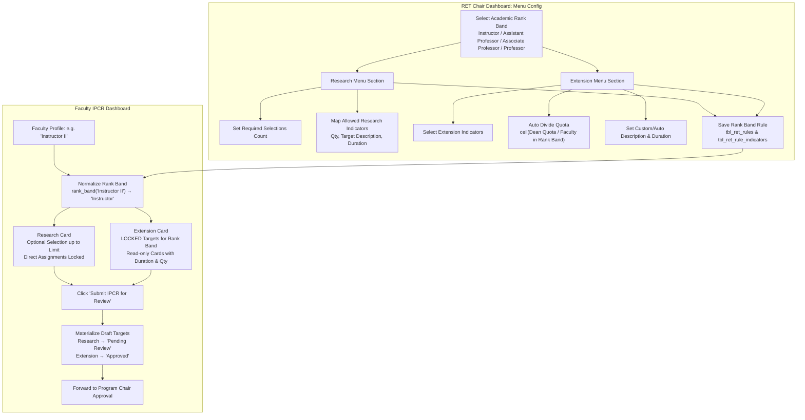

# RET Menu & Extension Distribution Refactor: Rank Band Normalization, Auto Divide & Locked Extension Targets

> **Document Status**: Approved Architecture & Implementation Design  
> **Target Scope**: RET Chair Menu Configuration (`Research` & `Extension`), Faculty IPCR Target Selection, and Rank Band Normalization.

---

## 1. Executive Summary

This refactor redesigns the **Research** and **Extension** workload configuration and distribution pipelines for the Research, Extension & Training (RET) Chair:

1. **Academic Rank Band Normalization**:
   Both Research Menu and Extension Menu configurations operate on standard **Academic Rank Bands** (`Instructor`, `Assistant Professor`, `Associate Professor`, `Professor`). Faculty members with specific academic sub-ranks (e.g. `Instructor I-III`, `Assistant Professor I-IV`, `Associate Professor I-V`, `Professor I-VI`) are automatically normalized to their respective Rank Band via `rank_band(academic_rank)`.

2. **Research Menu Configuration (Rank Band Specific & Optional)**:
   The RET Chair defines the maximum selection count (`research_selections`) and available research indicator options for each Academic Rank Band. Faculty members belonging to that rank band see these as **optional target selections** up to the required limit (with direct chair assignments pre-checked and locked).

3. **Extension Menu Configuration (Rank Band Specific, Auto Divide & Locked)**:
   Replaces the legacy one-time global extension distribution with a **Rank Band-specific Extension Menu** configuration.
   - **Auto Divide**: Adds an automated calculation tool that divides the cascaded Dean quota by the count of regular faculty in that Rank Band:
     $$\text{Target Qty per Faculty} = \lceil \text{Dean Quota} / \text{Faculty in Rank Band} \rceil$$
   - **Locked on Faculty Dashboard**: Unlike Research (which is optional selection), Extension targets configured for a faculty member's rank band are rendered as **LOCKED / Mandatory Targets** on the faculty dashboard.
   - **Auto-Approval Materialization**: On IPCR submission, Extension targets are materialized into `tbl_draft_targets` with `review_status = 'Approved'` so they flow directly to the Program Chair review stage.

---

## 2. End-to-End Workflow & Architecture

---

## 3. Academic Rank Band Normalization Model

### 3.1 Standard Canonical Bands
The system uses the four standard canonical bands defined in `app/models/criteria.py`:
- `Instructor`
- `Assistant Professor`
- `Associate Professor`
- `Professor`

### 3.2 Resolution & Fallback Logic
When querying rules for a faculty member:
1. **Primary Lookup**: Search `tbl_ret_rules` matching the exact `tbl_employee_profiles.academic_rank` (e.g. `'Instructor I'`).
2. **Fallback Lookup**: If no exact rank rule exists, resolve the canonical band via `rank_band(academic_rank)` (e.g. `'Instructor'`) and query `tbl_ret_rules`.
3. This guarantees that:
   - Configuring the 4 primary rank bands covers 100% of faculty members.
   - Any legacy rank-specific configurations continue to work without breaking.

---

## 4. Detailed Component Design

### 4.1 RET Chair Menu Configuration (UI & Logic)

1. **Rank Band Selector**:
   - Clean dropdown populated with `RANK_BANDS`: `Instructor`, `Assistant Professor`, `Associate Professor`, `Professor`.
   - Displays real-time regular faculty count badge for the currently selected rank band (e.g. *"5 Regular Faculty in this Band"*).

2. **Research Menu Panel**:
   - `research_selections`: Numeric count (0 to 10) representing how many research targets faculty in this band can pick.
   - List of cascaded Research indicators with checkboxes, quantity, description (with live auto-mirroring & reset button), duration value, and duration unit.

3. **Extension Menu Panel (with Auto Divide)**:
   - List of cascaded Extension indicators with checkboxes, quantity, description (with live auto-mirroring & reset button), duration value, and duration unit.
   - **Row-Level Auto Divide**: A `<button type="button" class="btn-auto-divide">` next to each Extension quantity input that computes $\lceil \text{Dean Quota} / \text{Faculty in Band} \rceil$.
   - **Section-Level Auto Divide All**: A header button to auto-divide all checked/available Extension indicators simultaneously.
   - Live description generation updates whenever the quantity or duration changes.

4. **Active Rules Table**:
   - Lists configured rules grouped by Rank Band.
   - Columns: `Academic Rank Band`, `Research Required`, `Research Options`, `Extension Locked Targets`, `Actions (Edit / Delete)`.
   - Clicking `Edit` populates both Research and Extension panels in the form for that rank band.

---

### 4.2 Faculty IPCR Experience

1. **Research Card (Optional Targets)**:
   - Displays available research options mapped to their rank band.
   - Checkboxes enabled up to `research_required`.
   - RET Chair direct assignments (from `tbl_ret_assignments`) are pre-selected and locked with badge *"Assigned by RET Chair"*.

2. **Extension Card (Locked Targets)**:
   - Displays rank-band extension targets as **Locked / Non-Selectable Cards**.
   - UI styling indicates mandatory assignment:
     - Badge: `<i class="ti ti-lock"></i> Required for <Rank Band>`
     - Formatted text: Generated IPCR accomplishment sentence with quantity and duration (e.g., *"Conduct 1 extension project for community partners in 6 months"*).

3. **Submission Pipeline (`submit_faculty_ipcr`)**:
   - Clears existing Research and Extension draft rows for the term.
   - Inserts selected Research targets with `review_status = 'Pending Review'` (or chair assignment status).
   - Inserts rank-band Extension targets with `review_status = 'Approved'`, carrying forward `target_quantity`, `target_description`, `target_duration_value`, and `target_duration_unit` so they are immediately scorable for Timeliness and visible to the Program Chair.

---

## 5. Database Schema & Persistence Strategy

Both Research and Extension configurations are persisted relationally in `tbl_ret_rules` and `tbl_ret_rule_indicators`:

### `tbl_ret_rules`
| Column | Type | Description |
|---|---|---|
| `rule_id` | INT (PK, Auto) | Unique rule ID |
| `academic_rank` | VARCHAR(255) | Canonical rank band (e.g. `'Instructor'`) or specific rank |
| `required_selections` | INT | Count of required research selections |

### `tbl_ret_rule_indicators`
| Column | Type | Description |
|---|---|---|
| `rule_indicator_id` | INT (PK, Auto) | Unique record ID |
| `rule_id` | INT (FK) | Reference to `tbl_ret_rules.rule_id` |
| `indicator_id` | INT (FK) | Reference to `tbl_master_indicators.indicator_id` |
| `target_quantity` | INT | Target quantity configured for this rank band |
| `target_description` | TEXT | Auto-generated or custom IPCR sentence |
| `target_duration_value` | INT | Deadline duration value (e.g. `6`) |
| `target_duration_unit` | ENUM | `'days'`, `'weeks'`, `'months'`, `'semesters'` |
| `is_auto_description` | TINYINT(1) | `1` = auto-mirroring active, `0` = customized |

*Note*: Indicator categories (`tbl_target_categories.slug = 'research'` vs `slug = 'extension'`) cleanly partition the rows without requiring schema modifications.

---

## 6. Implementation Checklist & File Modifications

### Backend Models
- [ ] **[app/models/ret_chair.py](file:///c:/Users/chest/Management-PCR/app/models/ret_chair.py)**:
  - Update `save_ret_rule`: accept and save `extension_indicators` with `(indicator_id, qty, desc, dur_value, dur_unit, is_auto_flag)`.
  - Update `get_ret_rules`: return full metadata for both Research and Extension indicators per rank band.
  - Add helper `get_faculty_counts_by_rank(cursor, term_id)` returning `{rank_band: count}` of regular faculty.
  - Update `get_faculty_ret_menu`: normalize rank band lookup using `rank_band(academic_rank)`.
- [ ] **[app/models/faculty.py](file:///c:/Users/chest/Management-PCR/app/models/faculty.py)**:
  - Update `get_faculty_ret_menu`: return rank-band matched Extension targets.
  - Update `submit_faculty_ipcr`: materialize rank-band Extension targets with `review_status = 'Approved'` and scorable duration values.

### Backend Routes
- [ ] **[app/routes/ret_chair.py](file:///c:/Users/chest/Management-PCR/app/routes/ret_chair.py)**:
  - `ret_chair_dashboard`: Pass `rank_bands=RANK_BANDS` and `faculty_rank_counts` to template.
  - `ret_chair_save_rule`: Parse `extension_indicator_ids[]`, `extension_quantity_*`, `extension_description_*`, `extension_dur_value_*`, `extension_dur_unit_*`, `extension_auto_*`.
- [ ] **[app/routes/faculty.py](file:///c:/Users/chest/Management-PCR/app/routes/faculty.py)**:
  - `faculty_dashboard`: Supply rank-band locked extension targets to the view.

### Frontend Templates
- [ ] **[app/templates/ret_chair_dashboard.html](file:///c:/Users/chest/Management-PCR/app/templates/ret_chair_dashboard.html)**:
  - Update Academic Rank selector to list canonical Rank Bands.
  - Add Extension Targets section inside Phase 2 Menu Config with quantity inputs, auto-description badges, duration inputs, and **Auto Divide** buttons.
  - Update Active Rules table to display Research and Extension configurations per Rank Band.
  - Update `editRule(...)` Javascript to populate both sections during edit.
  - Deprecate/remove separate legacy global extension distribution card.
- [ ] **[app/templates/faculty_dashboard.html](file:///c:/Users/chest/Management-PCR/app/templates/faculty_dashboard.html)**:
  - Update Extension card to display locked targets configured for the faculty's rank band with clear lock badges and duration descriptions.

---

## 7. Verification & Testing Matrix

| Test ID | Test Description | Expected Result |
|---|---|---|
| **T1** | RET Chair configures `Instructor` with 1 Research option and 1 Extension target (Auto Divide). | Rule saved in `tbl_ret_rules` and `tbl_ret_rule_indicators` under `'Instructor'` with duration and generated description. |
| **T2** | Auto Divide button clicked with Dean quota = 10 and 4 faculty in rank band. | Quantity is automatically calculated to $\lceil 10 / 4 \rceil = 3$, and description auto-mirrors with qty 3. |
| **T3** | Faculty member with rank `Instructor II` logs in. | Sees `Instructor` Research options (optional) and `Instructor` Extension targets (LOCKED). |
| **T4** | Faculty member with rank `Assistant Professor I` logs in. | Sees `Assistant Professor` configurations, isolated from `Instructor`. |
| **T5** | Faculty member clicks "Submit IPCR for Review". | Draft targets created with Research as `Pending Review` and Extension as `Approved`. |
| **T6** | Program Chair reviews submitted IPCR. | Extension targets appear as already RET-approved and ready for Program Chair review. |
| **T7** | Timeliness scoring calculation on finalized IPCR. | Extension targets calculate timeliness correctly using the persisted duration values. |
