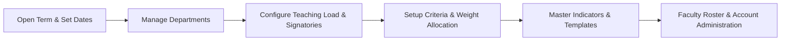
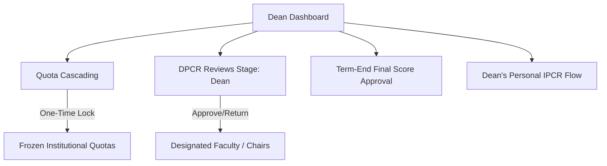
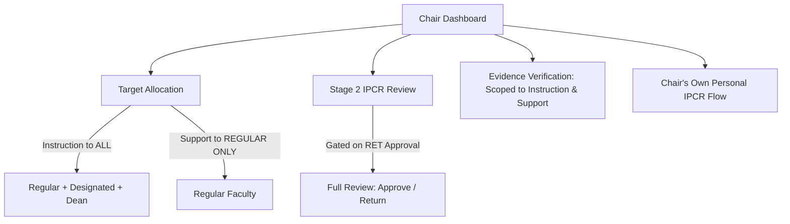
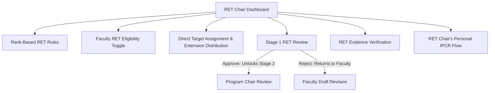
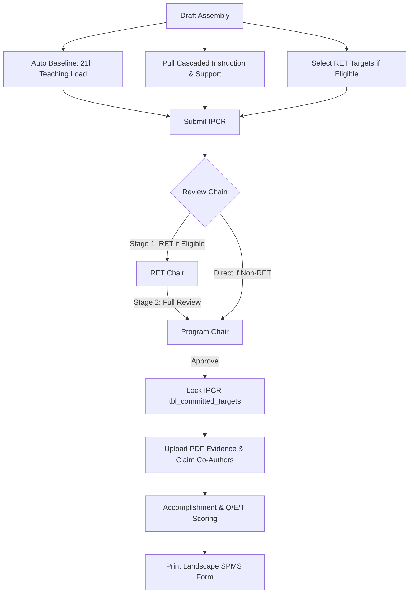
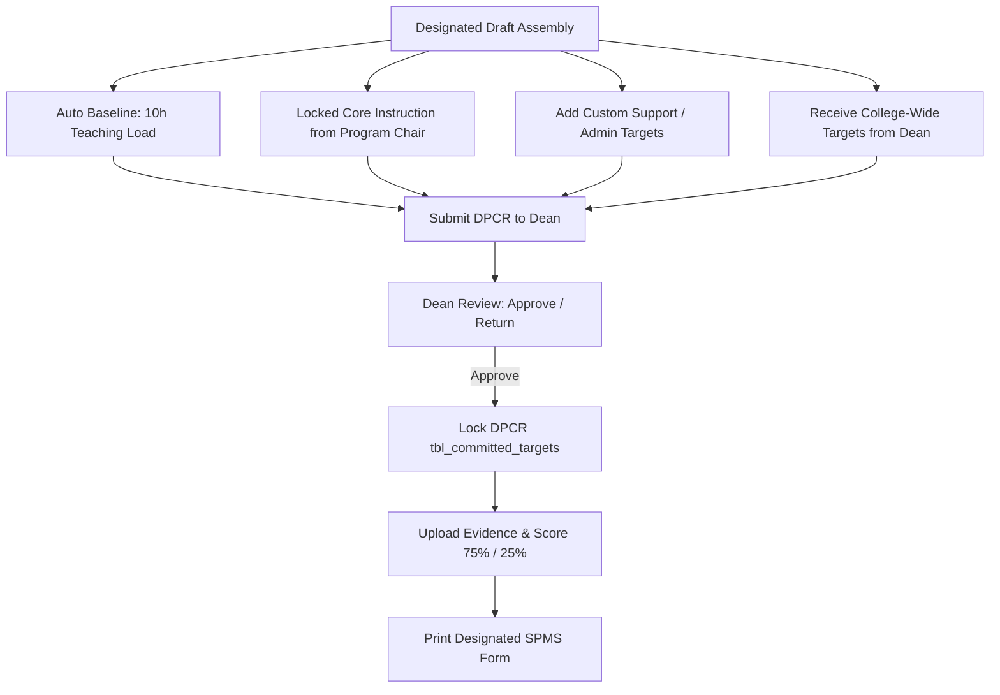
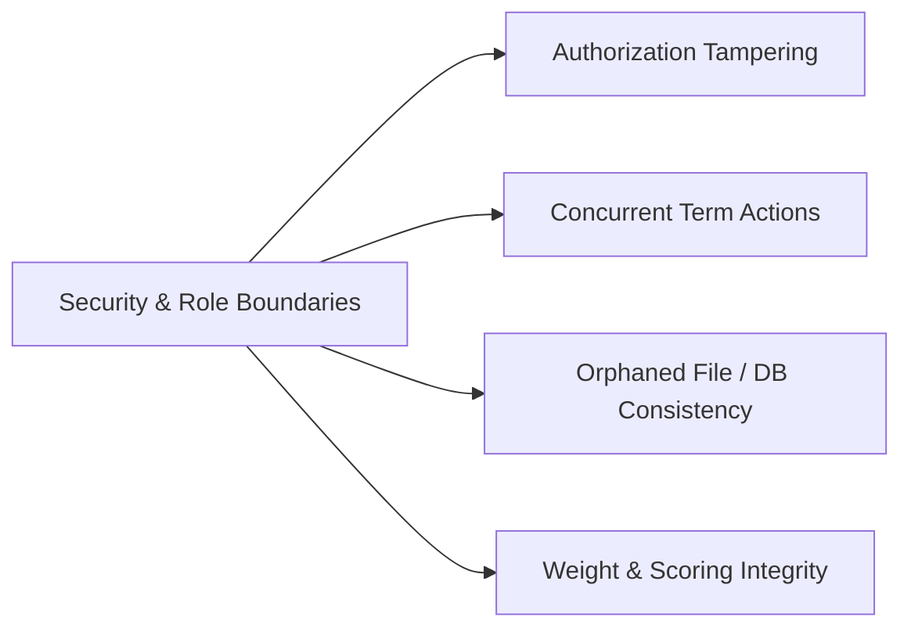

# D-IPCR System — Per-User Detailed Test Case Specification

**Product:** D-IPCR (Digital Individual Performance Commitment and Review System)  
**System Architecture:** Flask (Python 3.10+) + Direct MySQL Pool (autocommit=True)  
**Evaluation Standard:** CSC SPMS (Strategic Performance Management System) for Higher Education  
**Document Purpose:** Comprehensive, role-by-role test suites for verifying workflows, discovering bugs, identifying logic gaps, and ensuring compliance across all 6 user roles.

---

## 📋 Role Matrix & Quick Navigation

| User Role | Login `system_role` | Roster `designation` | Primary Responsibility | Quick Jump |
|---|---|---|---|---|
| **1. Admin** | `ADMIN` | `Admin` | System config, terms, departments, indicators, weight tables, roster | [Jump to Section 1](#1-system-administrator-admin) |
| **2. Dean** | `DEAN` | `Dean` | Quota cascade, DPCR reviews, batch score approval, personal IPCR | [Jump to Section 2](#2-college-dean-dean) |
| **3. Program Chair** | `PROGRAM_CHAIR` | `Program Chair` | Instruction/Support allocation, Stage 2 review, evidence verification | [Jump to Section 3](#3-program-chair-program_chair) |
| **4. RET Chair** | `RET_CHAIR` | `RET Chair` | Rank RET rules, RET eligibility, Stage 1 review, RET evidence | [Jump to Section 4](#4-research--extension-ret-chair-ret_chair) |
| **5. Regular Faculty** | `FACULTY` | `Regular Faculty` | Draft IPCR, RET targets, locking, PDF evidence, co-authoring, scoring | [Jump to Section 5](#5-regular-faculty-member-faculty) |
| **6. Designated Faculty** | `DESIGNATED_FACULTY` | `Designated Faculty` | 10h baseline, custom support targets, Dean review, 75/25 scoring | [Jump to Section 6](#6-plain-designated-faculty-member-designated_faculty) |
| **7. Security & Edge Cases** | *All Roles* | *All Designations* | Cross-role authorization, IDOR, race conditions, parameterization | [Jump to Section 7](#7-cross-role-security-edge-cases--flow-vulnerabilities) |

---

## 🏷️ Test Case Legend & Grading

- `[ ]` **Unchecked / Pending Execution**
- `[/]` **Passed** — Feature behaves exactly as specified
- `[!]` **Failed / Bug Detected** — Behavior deviates from expected output (log in [Section 8](#8-qa-bug--flow-observation-log))
- `[?]` **Flow Flaw / Logic Ambiguity** — Feature works technically but flow/UX is problematic
- `[-]` **Skipped** — Pre-conditions not met or intentionally skipped

---

# 1. System Administrator (`ADMIN`)

The Administrator is responsible for system configuration, academic term lifecycle, department structures, master indicators, rating weights, and user management.

---

### 1.1 Authentication, Access & Security

#### `TC-ADM-001` · Admin Login Success
- **Priority:** Critical · Positive Path
- **Preconditions:** Admin account exists in `tbl_faculty_roster` with `account_status = 'Active'` and `verification = 'APPROVED'`.
- **Test Steps:**
  1. Navigate to `/login`.
  2. Enter valid Admin email and password.
  3. Click **Sign In**.
- **Expected Results:**
  - [/] Successfully redirects to `/admin/`.
  - [/] Session established with `role='ADMIN'`, `is_admin=True`, and valid `user_id`.
  - [/] Admin dashboard displays active term banner, quick stats, and navigation menus.
- **Bug / Flow Checkpoint:** Stale sessions from other roles must be destroyed; verify no session fixation vulnerability.
- **Status:** `[ ] Pending` | **Notes:** _None_

---

#### `TC-ADM-002` · Failed Login Timing Attack Defense
- **Priority:** Medium · Security / Negative Path
- **Test Steps:**
  1. Navigate to `/login`.
  2. Enter a non-existent email with any password, submit form.
  3. Enter an existing Admin email with an incorrect password, submit form.
- **Expected Results:**
  - [/] Both attempts display identical generic error message: *"Invalid email or password."*
  - [/] Server enforces a ~0.5-second delay (`time.sleep(0.5)`) on failure to prevent timing enumeration attacks.
  - [/] Response does not reveal whether the email exists in the database.
- **Bug / Flow Checkpoint:** Verify error responses never mention *"User not found"* vs *"Incorrect password"*.
- **Status:** `[ ] Pending` | **Notes:** _None_

---

#### `TC-ADM-003` · Unapproved Account Login Protection
- **Priority:** High · Security / Edge Case
- **Test Steps:**
  1. Register a new account via `/register`.
  2. Attempt to log in immediately before Admin approval.
- **Expected Results:**
  - [/] Login is rejected with flash message: *"Account pending approval by administrator."*
  - [/] User is redirected back to `/login`.
  - [/] No access granted to any protected blueprints (`/admin/*`, `/faculty/*`, etc.).
- **Bug / Flow Checkpoint:** Verify session variables are not partially created when verification is unapproved.
- **Status:** `[ ] Pending` | **Notes:** _None_

---

#### `TC-ADM-004` · Admin Logout & Session Teardown
- **Priority:** High · Security
- **Test Steps:**
  1. While logged in as Admin, click **Logout**.
  2. Press browser **Back** button.
  3. Attempt to navigate directly to `/admin/open_term` via address bar.
- **Expected Results:**
  - [/] Session is destroyed via `session.clear()`.
  - [/] Browser Back button either reloads to `/login` or shows cached page that cannot trigger actions.
  - [/] Direct URL access triggers 302 redirect to `/login`.
- **Bug / Flow Checkpoint:** Ensure protected routes set `Cache-Control: no-cache, no-store, must-revalidate`.
- **Status:** `[ ] Pending` | **Notes:** _None_

---

### 1.2 Academic Term Lifecycle Management

#### `TC-ADM-005` · Open New Academic Term
- **Priority:** Critical · Core Flow
- **Preconditions:** Logged in as Admin.
- **Test Steps:**
  1. Navigate to Admin → **Term Configuration** (`/admin/open_term`).
  2. Fill form:
     - **Academic Year:** `2026-2027`
     - **Semester:** `1st Semester`
     - **Submission Deadline:** `2026-09-30`
     - **Rating Period From:** `2026-08-01`
     - **Rating Period To:** `2026-12-31`
  3. Click **Open Term**.
- **Expected Results:**
  - [/] New term record inserted into `tbl_academic_terms` with `is_active = TRUE`.
  - [/] Any previously active term automatically updated to `is_active = FALSE`.
  - [/] Exactly **one** active term exists in database (`SELECT COUNT(*) FROM tbl_academic_terms WHERE is_active = 1` equals `1`).
  - [/] Success message displayed: *"Academic term successfully opened."*
- **Bug / Flow Checkpoint:** Check transaction safety: if activation fails, rollback must ensure previous term remains active.
- **Status:** `[ ] Pending` | **Notes:** _None_

---

#### `TC-ADM-006` · Term Date Validation & Guard
- **Priority:** Medium · Validation
- **Test Steps:**
  1. Attempt to open a term with **Rating Period To** earlier than **Rating Period From**.
  2. Attempt to open a term with blank Academic Year or invalid date format.
- **Expected Results:**
  - [/] Form submission halted with validation error.
  - [/] No database state modification occurs.
- **Bug / Flow Checkpoint:** Verify server-side validation catches manipulated POST requests bypassing HTML5 date inputs.
- **Status:** `[ ] Pending` | **Notes:** 

Comments/Suggestion: Add term overlap prevention: prevent opening a term with overlapping dates with existing terms.
---

#### `TC-ADM-007` · Audit Logging for Term Operations
- **Priority:** Medium · Compliance
- **Test Steps:**
  1. Open a new term.
  2. Navigate to Admin → **Audit Logs** (`/admin/audit_logs`) or inspect `tbl_audit_logs`.
- **Expected Results:**
  - [/] Record logged with `action = 'OPEN_TERM'`.
  - [/] `actor_id` matches current Admin user ID.
  - [/] Remote IP address and timestamp recorded accurately.
- **Status:** `[ ] Pending` | **Notes:** _None_

---

### 1.3 Institution Setup (Departments, Teaching Load & Signatories)

#### `TC-ADM-008` · Department / Program Management (Add, Edit, Reorder)
- **Priority:** High · Core Setup
- **Test Steps:**
  1. Navigate to Admin → **Institution Setup** → *Departments* (`/admin/departments`).
  2. Click **Add Department**:
     - **Name:** `Master of Science in Technology`
     - **Code:** `MST`
     - **Display Order:** `50`
  3. Edit department code to `MST-PROG` and order to `55`.
- **Expected Results:**
  - [/] Department saved in `tbl_departments`.
  - [/] Display order determines sorting order in Dean's Quota Cascading screen.
  - [/] Editing updates existing record without duplicate key conflicts.
- **Bug / Flow Checkpoint:** Ensure editing department name updates or safely handles existing faculty assigned to that department.
- **Status:** `[ ] Pending` | **Notes:** _None_

---

#### `TC-ADM-009` · Department Soft Deactivation
- **Priority:** Medium · Flow Integrity
- **Test Steps:**
  1. In Department list, toggle status of `MST-PROG` to **Inactive**.
  2. Log in as Dean and open Quota Cascading (`/dean/cascade_quotas`).
- **Expected Results:**
  - [/] Department status displays "Inactive" in Admin panel.
  - [/] Deactivated department is **hidden** from Dean's quota distribution columns.
- **Bug / Flow Checkpoint:** Verify existing faculty records assigned to inactive departments do not trigger 500 errors on dashboard load.
- **Status:** `[ ] Pending` | **Notes:** _None_

---

#### `TC-ADM-010` · Teaching Load Baseline Setup (General vs Per-Rank)
- **Priority:** High · Core Business Logic
- **Test Steps:**
  1. Navigate to **Institution Setup** → *Teaching Load* (`/admin/teaching_load`).
  2. Verify system defaults: Regular Faculty = `21 hrs` / `6 months`; Designated Faculty = `10 hrs` / `6 months`.
  3. Toggle mode to **"Per Academic Rank"**.
  4. Set Instructor = `18 hrs`, Assistant Professor = `15 hrs`. Save.
  5. Toggle back to **"Same for all ranks"**, set `21 hrs` / `6 months`. Save.
- **Expected Results:**
  - [/] Settings persist in `tbl_teaching_load_settings`.
  - [/] Per-rank settings apply to faculty matching that rank during draft IPCR assembly.
  - [/] Form locks after saving; requires clicking **Edit** button to modify again.
- **Bug / Flow Checkpoint:** Verify switching between "Per Rank" and "All Ranks" does not corrupt stored baseline hours.
- **Status:** `[ ] Pending` | **Notes:** _None_

---

#### `TC-ADM-011` · Printed IPCR Signatory Configuration & Self-Healing
- **Priority:** High · Output Document Configuration
- **Test Steps:**
  1. Navigate to **Institution Setup** → *Printed IPCR* (`/admin/signatories`).
  2. Inspect 4 standard signatory blocks:
     - *Reviewed by* · *Approved by* · *Assessed by* · *Final Rating by*
  3. Set "Reviewed by" source to **"Their Program Chair"** (Derived). Verify Name input is disabled.
  4. Set "Approved by" source to **"A named person"** → Enter `Dr. Maria Santos`. Save.
  5. Attempt to save a "Named person" block with an empty name field.
  6. **Self-Healing Test:** Truncate `tbl_ipcr_signatories` in DB and refresh page.
- **Expected Results:**
  - [/] Selecting derived options disables free-text name input.
  - [/] Saving empty named person is blocked with validation error.
  - [/] **Self-healing:** Empty table is automatically re-populated with standard 4 signatory blocks upon page reload without crash.
- **Status:** `[ ] Pending` | **Notes:** _None_

Comments/Suggestion: Validation for empty named person should not wait for website reload. Validation error should be displayed immediately when the field is empty (maybe follow the red highlight system when input is invalid (not checked or empty))
---

### 1.4 Criteria, Categories & Weight Rules

#### `TC-ADM-012` · Target Types (Criteria) & Slug Immutability
- **Priority:** High · Routing Foundation
- **Test Steps:**
  1. Navigate to Admin → **Criteria** (`/admin/criteria`).
  2. Click **Add Target Type**:
     - **Name:** `Community Outreach`
     - **Review Lane:** `CHAIR`
     - **Is Core:** Checked (`1`)
     - **Display Order:** `60`
  3. Verify slug auto-generates as `community_outreach`.
  4. Edit Name to `Community Extension & Outreach`. Save.
- **Expected Results:**
  - [ ] Record created in `tbl_ipcr_category_types`.
  - [ ] Editing Name changes the display label, but **slug remains immutable** (`community_outreach`).
  - [ ] Built-in core slugs (`instruction`, `research`, `extension`, `support`, `administrative`, `custom`) cannot be deleted or have their slugs changed.
- **Bug / Flow Checkpoint:** Slug immutability is critical because backend review routing hardcodes slug checks.
- **Status:** `[ ] Pending` | **Notes:** _None_

---

#### `TC-ADM-013` · Category Management per Designation
- **Priority:** High · SPMS Core Concept
- **Test Steps:**
  1. Navigate to Admin → **Category Management** (`/admin/categories`).
  2. Inspect mappings for **Regular Faculty**:
     - Strategic Priorities → `instruction`
     - Core Functions → `research`, `extension`
     - Support Functions → `support`
  3. Inspect mappings for **Designated Faculty**:
     - Strategic Priorities / Support Functions → `administrative`, `support`
     - Core Functions → `instruction`
- **Expected Results:**
  - [ ] UI reflects distinct mapping per designation.
  - [ ] Instructions maps to Strategic Priorities for Regular Faculty, but Core Functions for Designated Faculty.
  - [ ] Modifying category target type associations persists in `tbl_target_categories`.
- **Status:** `[ ] Pending` | **Notes:** _None_

---

#### `TC-ADM-014` · Weight Allocation Strict 100% Validation
- **Priority:** Critical · Scoring Foundation
- **Test Steps:**
  1. Navigate to Admin → **Weight Allocation** (`/admin/weights`).
  2. For Regular Faculty (General), input:
     - Strategic Priorities: `40%` · Core Functions: `40%` · Support Functions: `10%` (Sum = `90%`).
  3. Attempt to save.
  4. Change to `50%` / `40%` / `10%` (Sum = `100%`) and save.
  5. For Designated Faculty (General), set `75%` / `25%` and save.
- **Expected Results:**
  - [ ] Saving 90% is rejected: badge turns red, alert displays *"Total weight must equal exactly 100%"*. Nothing is written to DB.
  - [ ] Saving 100% succeeds: badge turns green, weights saved in `tbl_ipcr_category_weights`.
  - [ ] Designated weights save independently without modifying Regular weights.
- **Bug / Flow Checkpoint:** Test "Copy weights from previous term" button to verify older term values import accurately.
- **Status:** `[ ] Pending` | **Notes:** _None_

---

### 1.5 Master Indicators & Template Authoring

#### `TC-ADM-015` · Master Indicator Creation with Placeholder Click-to-Tag
- **Priority:** High · Narrative Engine
- **Test Steps:**
  1. Navigate to Admin → **Master Indicators** (`/admin/indicators`).
  2. Click **Add Target** under Core Functions → Select `Research`.
  3. In Description box, enter:
     `"Publish 2 Scopus-indexed research papers within 12 months"`
  4. Click detected number `2` → Select **Tag as Qty**.
  5. Click detected text `12 months` → Select **Tag as Duration**.
  6. Click **Save Indicator**.
- **Expected Results:**
  - [ ] Stored description contains tokens: `Publish {qty:2} Scopus-indexed research papers within {duration:12:months}`.
  - [ ] Master Indicators list displays clean sentence with default numbers (not raw curly brace tokens).
  - [ ] Tagging "Undo last tag" button cleanly reverts token back to plain text before saving.
- **Bug / Flow Checkpoint:** Verify duration tag consumes both the number and the unit word (`12 months` as one token).
- **Status:** `[ ] Pending` | **Notes:** _None_

---

#### `TC-ADM-016` · Efficiency Type Assignment
- **Priority:** Medium · Scoring Setup
- **Test Steps:**
  1. Create/Edit an Instruction indicator → Set Efficiency Type to **Client Satisfaction**.
  2. Create/Edit an Administrative indicator → Set Efficiency Type to **Computed Efficiency**.
- **Expected Results:**
  - [ ] Value persists in `tbl_master_indicators.efficiency_type`.
  - [ ] Client Satisfaction indicators prompt for 1–5 score during faculty accomplishment entry.
  - [ ] Computed indicators calculate efficiency from standard formulas.
- **Status:** `[ ] Pending` | **Notes:** _None_

---

#### `TC-ADM-017` · Master Indicator Deletion Guard
- **Priority:** High · Referential Integrity
- **Test Steps:**
  1. Identify an indicator currently allocated in active drafts or committed targets.
  2. Attempt to delete it from the Admin interface.
  3. Create an unused indicator and delete it.
- **Expected Results:**
  - [ ] Attempting to delete an assigned indicator is blocked with clear error: *"Cannot delete indicator in active use."*
  - [ ] Unused indicator deletes cleanly without database errors.
- **Bug / Flow Checkpoint:** Ensure deletion block does not throw unhandled MySQL foreign key 500 error.
- **Status:** `[ ] Pending` | **Notes:** _None_

---

### 1.6 Faculty Roster & Account Administration

#### `TC-ADM-018` · Batch Faculty Roster Import via CSV
- **Priority:** High · Data Ingestion
- **Test Steps:**
  1. Navigate to Admin → **Faculty Roster** → *Import CSV* (`/admin/csv/import`).
  2. Prepare CSV with columns: `employee_id_number`, `first_name`, `last_name`, `college`, `assigned_program`, `specialization`, `academic_rank`, `employment_status`, `leave_status`, `designation`.
  3. Upload valid CSV file.
  4. Upload invalid file (wrong extension, corrupted headers, duplicate employee IDs).
- **Expected Results:**
  - [ ] Valid CSV populates `tbl_faculty_roster`.
  - [ ] Invalid file/headers fails gracefully with descriptive error message without partial dirty writes.
  - [ ] CSV import action is recorded in `tbl_audit_logs`.
- **Status:** `[ ] Pending` | **Notes:** _None_

---

#### `TC-ADM-019` · Emergency Account Lock / Status Toggle
- **Priority:** Critical · Security
- **Test Steps:**
  1. In Faculty Roster list, locate an active faculty member and toggle status to **"Inactive"**.
  2. In an incognito browser window, attempt to log in with that user's credentials.
- **Expected Results:**
  - [ ] Record updated in DB: `account_status = 'Inactive'`.
  - [ ] Login attempt rejected: *"Your account is deactivated. Please contact administrator."*
  - [ ] If user has an active session, next authenticated action forces redirect to `/login`.
- **Status:** `[ ] Pending` | **Notes:** _None_

---

#### `TC-ADM-020` · Admin Password Reset & Policy Enforcement
- **Priority:** High · Security
- **Test Steps:**
  1. Click **Reset Password** on a faculty profile.
  2. Attempt to set weak password: `password123` (no special char, no uppercase).
  3. Set strong password: `P@ssword2026!` (8+ chars, upper, lower, digit, special, no spaces).
- **Expected Results:**
  - [ ] Weak password rejected with policy error message.
  - [ ] Strong password hashed with `bcrypt` (12 rounds) and saved.
  - [ ] Action logged in `tbl_audit_logs`.
- **Status:** `[ ] Pending` | **Notes:** _None_

---

# 2. College Dean (`DEAN`)

The Dean cascades master quotas to departments, reviews Designated Faculty and Chair IPCRs (DPCRs), batch-approves final term scores, and submits their personal IPCR.

---

### 2.1 Quota Cascading (College-Wide Distribution)

#### `TC-DEN-001` · Quota Cascading Grid Population & Term Guard
- **Priority:** Critical · Cascade Step 1
- **Preconditions:** Logged in as Dean (`system_role = 'DEAN'`). Term is active.
- **Test Steps:**
  1. Navigate to Dean → **Quota Cascading** (`/dean/cascade_quotas`).
  2. Inspect column headers and indicator rows.
- **Expected Results:**
  - [ ] Columns dynamically display all active departments + `RET / Extension` + `College-Wide`.
  - [ ] Inactive departments (from TC-ADM-009) do NOT appear.
  - [ ] All master indicators appear grouped under correct category headings.
  - [ ] If no active term exists, page redirects with flash alert: *"No active term open."*
- **Status:** `[ ] Pending` | **Notes:** _None_

---

#### `TC-DEN-002` · Quota Input Sanitization & Real-time Row Totals
- **Priority:** Medium · Validation
- **Test Steps:**
  1. Enter positive integer quotas (e.g. `WST=5`, `DST=4`, `RET=3`, `College-Wide=2`).
  2. Attempt to input negative numbers (`-5`), decimals (`2.5`), or text (`abc`).
- **Expected Results:**
  - [ ] Invalid inputs sanitized/blocked.
  - [ ] Row total column computes sum in real time.
- **Status:** `[ ] Pending` | **Notes:** _None_

---

#### `TC-DEN-003` · Unallocated Targets Warning Modal
- **Priority:** High · Flow Usability
- **Test Steps:**
  1. Leave one or more master indicators with 0 total allocated quota across all columns.
  2. Click **Cascade Institutional Targets**.
- **Expected Results:**
  - [ ] Warning modal appears listing names of indicators with zero allocation.
  - [ ] Modal offers option to return and fill quotas or confirm proceeding with unassigned items.
- **Status:** `[ ] Pending` | **Notes:** _None_

---

#### `TC-DEN-004` · Permanent Cascade Lock Confirmation
- **Priority:** Critical · Workflow Freeze
- **Test Steps:**
  1. Fill all required department quotas.
  2. Click **Cascade Institutional Targets**.
  3. In confirmation modal, review target summary and lock warning:
     *"Cascading is a one-time action and permanently locks quotas for this term."*
  4. Click **Confirm & Cascade**.
  5. Refresh the Quota Cascading page.
- **Expected Results:**
  - [ ] Quotas saved in `tbl_cascaded_quotas`.
  - [ ] Success message displayed; page shows **"Cascaded & Locked"** badge.
  - [ ] All input fields are disabled; "Cascade" button is removed.
  - [ ] Direct POST to `/dean/cascade_quotas` returns 403 Forbidden.
- **Bug / Flow Checkpoint:** Ensure quota lock prevents accidental overwrite once Program Chairs begin distributing to faculty.
- **Status:** `[ ] Pending` | **Notes:** _None_

---

### 2.2 Designated Faculty & Chair IPCR Review (Stage: Dean Review)

#### `TC-DEN-005` · Review Queue Filtering & Role Isolation
- **Priority:** High · Review Lane Scoping
- **Test Steps:**
  1. Navigate to Dean → **IPCR Reviews** (`/dean/reviews`).
  2. Inspect listed submissions.
- **Expected Results:**
  - [ ] Lists all submitted DPCRs from `DESIGNATED_FACULTY`, `PROGRAM_CHAIR`, and `RET_CHAIR`.
  - [ ] Regular Faculty submissions do NOT appear here (they route to Program Chairs).
  - [ ] Dean's own IPCR is excluded from their review list.
- **Status:** `[ ] Pending` | **Notes:** _None_

---

#### `TC-DEN-006` · DPCR Target Inspection & Quantity Adjustment
- **Priority:** High · Review Action
- **Test Steps:**
  1. Open a Program Chair's or Designated Faculty member's DPCR review (`/dean/review_ipcr/<emp_id>`).
  2. Inspect Instruction targets (Core) and Administrative/Support targets (Strategic).
  3. Adjust an assigned quantity (e.g. from `5` to `4`) and enter remark: *"Adjusted to align with revised college priorities"*.
  4. Click **Save Item Review**.
- **Expected Results:**
  - [ ] Adjustment and remark saved in `tbl_ipcr_dean_review_items`.
  - [ ] Target description automatically updates to reflect new quantity if auto-description is enabled.
- **Status:** `[ ] Pending` | **Notes:** _None_

---

#### `TC-DEN-007` · Return DPCR with Remarks
- **Priority:** High · Return Flow
- **Test Steps:**
  1. In DPCR review screen, enter overall return remarks.
  2. Click **Return to Faculty** (`/dean/decide_ipcr` action `RETURN`).
- **Expected Results:**
  - [ ] Header status in `tbl_ipcr_dean_review` set to `Returned`.
  - [ ] Overall status transitions to `Returned for Revision`.
  - [ ] Submitter's dashboard unlocked for editing; item remarks displayed.
  - [ ] Submitter resubmission preserves Dean-adjusted quantities.
- **Status:** `[ ] Pending` | **Notes:** _None_

---

#### `TC-DEN-008` · Approve DPCR
- **Priority:** Critical · Approval Flow
- **Test Steps:**
  1. In DPCR review screen, verify all items reviewed.
  2. Click **Approve DPCR** (`/dean/decide_ipcr` action `APPROVE`).
- **Expected Results:**
  - [ ] Header status set to `Approved`.
  - [ ] Overall status transitions to `Approved (Pending Lock)`.
  - [ ] Submitter can now click "Lock IPCR".
- **Status:** `[ ] Pending` | **Notes:** _None_

---

### 2.3 Term-End Final Score & Adjectival Rating Approval

#### `TC-DEN-009` · Final Scores Summary & Adjectival Thresholds
- **Priority:** High · Scoring Verification
- **Test Steps:**
  1. Navigate to Dean → **Final Score Approvals** (`/dean/final_scores`).
  2. Inspect faculty score rollups.
- **Expected Results:**
  - [ ] Displays Q/E/T averages, Final Weighted Rating, and adjectival band.
  - [ ] Adjectival mapping matches SPMS standard:
    - `>= 4.75` → Outstanding
    - `>= 3.75` → Very Satisfactory
    - `>= 3.00` → Satisfactory
    - `>= 2.01` → Unsatisfactory
    - `< 2.01` → Poor
  - [ ] Incomplete faculty are clearly flagged.
- **Status:** `[ ] Pending` | **Notes:** _None_

---

#### `TC-DEN-010` · Batch Final Score Approval
- **Priority:** High · Term Completion
- **Test Steps:**
  1. Select eligible faculty members using checkboxes (or click "Select All").
  2. Click **Approve Selected Scores**. Confirm dialog.
- **Expected Results:**
  - [ ] Records updated in `tbl_final_scores` with `dean_approved = 1` and `approval_date = NOW()`.
  - [ ] Faculty members can now generate and print finalized, signed IPCRs.
- **Status:** `[ ] Pending` | **Notes:** _None_

---

### 2.4 Dean's Personal IPCR Workflow

#### `TC-DEN-011` · Dean Personal IPCR Setup & Submission
- **Priority:** High · Designated Flow
- **Test Steps:**
  1. While logged in as Dean, navigate to **My Personal IPCR** (`/designated/`).
  2. Verify pre-populated targets:
     - Baseline `10 hours Teaching Load` under Core Functions.
     - Cascaded instruction targets from Program Chair under Core Functions.
     - College-Wide targets under Strategic Priorities.
  3. Submit IPCR.
- **Expected Results:**
  - [ ] Personal IPCR scores using Designated weight table (75% / 25%).
  - [ ] Dean cannot approve their own IPCR in the review dashboard.
  - [ ] Print preview renders Dean title with Head of Agency / VPAA as final signatory.
- **Status:** `[ ] Pending` | **Notes:** _None_

---

# 3. Program Chair (`PROGRAM_CHAIR`)

The Program Chair distributes departmental Instruction and Support targets, conducts Stage 2 review of Regular Faculty IPCRs, inspects Instruction/Support evidence, and submits their personal IPCR.

---

### 3.1 Target Allocation & Intermediate Distribution

#### `TC-PCH-001` · Roster Scoping in Allocation Screen
- **Priority:** High · Department Isolation
- **Preconditions:** Logged in as Program Chair (`system_role = 'PROGRAM_CHAIR'`).
- **Test Steps:**
  1. Navigate to Program Chair → **Target Allocation** (`/prog_chair/assign_target`).
  2. Inspect faculty list in the assignment table/dropdown.
- **Expected Results:**
  - [ ] Lists all Regular Faculty in the Chair's department.
  - [ ] **Also lists** the Dean, the Program Chair, the RET Chair, and other Designated Faculty in that department for Instruction allocation.
  - [ ] Faculty from other departments are strictly excluded.
- **Status:** `[ ] Pending` | **Notes:** _None_

---

#### `TC-PCH-002` · Instruction Target Distribution & Live Auto-Mirroring
- **Priority:** High · Narrative Engine
- **Test Steps:**
  1. Select an Instruction indicator.
  2. Input quantity `3`, duration `1`, unit `semester` for a faculty member.
  3. Observe description field.
- **Expected Results:**
  - [ ] Description field live-updates to: `"3 [Indicator Text] within 1 semester"`.
  - [ ] Small **"Auto"** badge is displayed next to description.
  - [ ] Allocation persists in `tbl_draft_allocation`.
- **Status:** `[ ] Pending` | **Notes:** _None_

---

#### `TC-PCH-003` · Custom Description Overriding & Reset-to-Auto
- **Priority:** High · Usability
- **Test Steps:**
  1. Type custom text over the auto-generated description.
  2. Change the quantity value in the quantity box.
  3. Click **Reset to Auto**.
- **Expected Results:**
  - [ ] Typing custom text hides "Auto" badge and displays **"Reset to Auto"** button.
  - [ ] Changing quantity does NOT overwrite manually typed custom text.
  - [ ] Clicking "Reset to Auto" restores auto-generated text and reinstates "Auto" badge.
  - [ ] `is_auto_description` flag in `tbl_draft_allocation` correctly reflects state (`0` or `1`).
- **Status:** `[ ] Pending` | **Notes:** _None_

---

#### `TC-PCH-004` · Support Functions Role Scoping
- **Priority:** High · Business Logic
- **Test Steps:**
  1. Select a Support Function indicator in the allocation panel.
  2. Inspect faculty assignment options.
- **Expected Results:**
  - [ ] Support targets are available for **Regular Faculty ONLY**.
  - [ ] Designated Faculty, Program Chairs, and Dean are disabled/hidden for Support target allocation (they author custom support items).
- **Status:** `[ ] Pending` | **Notes:** _None_

---

#### `TC-PCH-005` · Allocation Finalization Lock
- **Priority:** Medium · State Guard
- **Test Steps:**
  1. Save departmental target allocations.
  2. Click **Finalize Allocations**.
  3. Attempt to modify and re-save allocations.
- **Expected Results:**
  - [ ] Allocations committed to `tbl_draft_allocation`.
  - [ ] Re-saving is blocked with warning: *"Allocations have been finalized for this term."*
  - [ ] Allocations immediately visible in faculty draft IPCR screens.
- **Status:** `[ ] Pending` | **Notes:** _None_

---

### 3.2 Stage 2 IPCR Review (Regular Faculty)

#### `TC-PCH-006` · RET Stage 1 Dependency Gate (Stage 2 Blocked)
- **Priority:** Critical · Pipeline Sequence
- **Preconditions:** An RET-eligible faculty member submitted an IPCR with Research targets. RET Chair has NOT approved yet.
- **Test Steps:**
  1. Program Chair attempts to open `/prog_chair/review_ipcr/<emp_id>`.
  2. Program Chair attempts direct POST to `/prog_chair/decide_ipcr` for that faculty ID.
- **Expected Results:**
  - [ ] Page access blocked with HTTP 403 or notification: *"Awaiting Stage 1 RET Chair approval. Program Chair review is locked."*
  - [ ] Status shows `Pending RET Review`.
  - [ ] Program Chair cannot bypass or approve until RET Chair records approval.
- **Status:** `[ ] Pending` | **Notes:** _None_

---

#### `TC-PCH-007` · Non-RET Direct Routing
- **Priority:** High · Workflow Routing
- **Preconditions:** A non-RET faculty member submits an IPCR (Instruction + Support only).
- **Test Steps:**
  1. Program Chair navigates to IPCR Reviews.
  2. Open the faculty member's review (`/prog_chair/review_ipcr/<emp_id>`).
- **Expected Results:**
  - [ ] Review page opens immediately (Stage 1 is bypassed automatically).
  - [ ] Status reads `Pending Program Chair Review`.
  - [ ] Review screen shows baseline teaching load, instruction, and support targets.
- **Status:** `[ ] Pending` | **Notes:** _None_

---

#### `TC-PCH-008` · Item-Level Review Remarks & Quantity Adjustment
- **Priority:** High · Review Action
- **Test Steps:**
  1. In the review screen, reduce an Instruction target quantity from `3` to `2`.
  2. Enter item remark: *"Reduced due to curriculum schedule adjustment"*.
  3. Save item review (`/prog_chair/edit_review_item`).
- **Expected Results:**
  - [ ] Item saved in `tbl_ipcr_chair_review_items`.
  - [ ] Interface displays requested vs approved quantity diff.
  - [ ] Approved quantity will be used when targets are committed.
- **Status:** `[ ] Pending` | **Notes:** _None_

---

#### `TC-PCH-009` · Return IPCR with Remarks
- **Priority:** High · Return Cycle
- **Test Steps:**
  1. In review screen, enter general return remarks.
  2. Click **Return to Faculty** (`/prog_chair/decide_ipcr` action `RETURN`).
- **Expected Results:**
  - [ ] Header status in `tbl_ipcr_chair_review` set to `Returned`.
  - [ ] Faculty member's draft unlocked for revision; remarks displayed.
  - [ ] Faculty resubmission preserves Chair-adjusted quantities.
- **Status:** `[ ] Pending` | **Notes:** _None_

---

#### `TC-PCH-010` · Approve IPCR (Unlocking Lock Action)
- **Priority:** Critical · Approval Hand-off
- **Test Steps:**
  1. Program Chair clicks **Approve IPCR** (`/prog_chair/decide_ipcr` action `APPROVE`).
- **Expected Results:**
  - [ ] Header status set to `Approved`.
  - [ ] Overall status transitions to `Approved (Pending Lock)`.
  - [ ] Faculty member can now see and click **Lock IPCR** button.
- **Status:** `[ ] Pending` | **Notes:** _None_

---

### 3.3 Evidence Inspection & Verification (Scoped to Instruction & Support)

#### `TC-PCH-011` · Category Scoping in Evidence Verification
- **Priority:** High · Role Boundary
- **Test Steps:**
  1. Navigate to Program Chair → **Evidence Verification** (`/prog_chair/evidence`).
  2. Select a faculty member with Instruction, Support, and Research evidence uploaded.
- **Expected Results:**
  - [ ] Program Chair ONLY sees and verifies targets under **Instruction** and **Support Functions**.
  - [ ] Research and Extension targets are hidden or explicitly marked "Managed by RET Chair".
- **Bug / Flow Checkpoint:** Ensure Chair cannot approve or alter RET evidence records via POST tampering.
- **Status:** `[ ] Pending` | **Notes:** _None_

---

#### `TC-PCH-012` · Evidence PDF Viewing & Verification Decision
- **Priority:** High · Verification
- **Test Steps:**
  1. Click "View PDF" on an uploaded evidence record.
  2. Click **Verify / Accept Evidence** (`/prog_chair/verify_evidence`).
  3. On a different evidence record, click **Reject Evidence** and enter feedback remark.
- **Expected Results:**
  - [ ] PDF opens in browser viewer.
  - [ ] Accepted evidence updates verification status in `tbl_target_evidence`.
  - [ ] Rejected evidence updates status to `Returned` with feedback visible to faculty.
- **Status:** `[ ] Pending` | **Notes:** _None_

---

### 3.4 Program Chair's Personal IPCR

#### `TC-PCH-013` · Chair Personal IPCR Flow
- **Priority:** High · Designated Flow
- **Test Steps:**
  1. Program Chair navigates to **My Personal IPCR** (`/designated/`).
  2. Assemble targets: 10h baseline + allocated instruction + custom admin targets.
  3. Submit IPCR.
- **Expected Results:**
  - [ ] Submits via Designated Faculty lane.
  - [ ] Automatically routes to **Dean Review** (does NOT route to self).
  - [ ] Scored using Designated weight table (75% / 25%).
- **Status:** `[ ] Pending` | **Notes:** _None_

---

# 4. Research & Extension (RET) Chair (`RET_CHAIR`)

The RET Chair manages rank-based Research/Extension rules, configures faculty RET eligibility, conducts Stage 1 reviews of Research/Extension targets, and verifies RET evidence.

---

### 4.1 Rank-Based Rules & Indicator Menu

#### `TC-RET-001` · Configure Research Rules per Academic Rank
- **Priority:** High · Rules Engine
- **Preconditions:** Logged in as RET Chair (`system_role = 'RET_CHAIR'`).
- **Test Steps:**
  1. Navigate to RET Chair → **Menu Config** (`/ret_chair/`).
  2. Select Academic Rank: `Associate Professor`.
  3. Select mandatory Research indicators, set minimum selection count = `2`, target quantity = `1`, duration = `12 months`.
  4. Click **Save Rule** (`/ret_chair/save_rule`).
- **Expected Results:**
  - [ ] Rules saved in `tbl_ret_rules` and `tbl_ret_rule_indicators`.
  - [ ] Saving completely replaces previous rule rows for that rank (clean rewrite, no orphaned indicators).
  - [ ] Only Research indicators are available in this configuration menu.
- **Status:** `[ ] Pending` | **Notes:** _None_

---

#### `TC-RET-002` · Delete Rank Rule
- **Priority:** Medium · Rules Engine
- **Test Steps:**
  1. Select an academic rank with existing rules.
  2. Click **Delete Rule** (`/ret_chair/delete_rule`).
- **Expected Results:**
  - [ ] Associated records in `tbl_ret_rules` and `tbl_ret_rule_indicators` removed.
  - [ ] Faculty of that rank no longer prompted with mandatory selection quota for Research.
- **Status:** `[ ] Pending` | **Notes:** _None_

---

### 4.2 Faculty RET Eligibility Access Control

#### `TC-RET-003` · Toggle Faculty RET Eligibility
- **Priority:** Critical · Access Control
- **Test Steps:**
  1. Navigate to RET Chair → **Faculty Access** (`/ret_chair/faculty_access`).
  2. Toggle RET Eligibility to **ON** for `Faculty Member A` (Regular Faculty).
  3. Toggle RET Eligibility to **OFF** for `Faculty Member B`.
  4. Save changes.
  5. Log in as `Faculty Member A` and open `/faculty/`.
  6. Log in as `Faculty Member B` and open `/faculty/`.
- **Expected Results:**
  - [ ] Changes saved in `tbl_ret_faculty_access`.
  - [ ] `Faculty Member A` sees the **Research & Extension selection menu**.
  - [ ] `Faculty Member B` sees NO RET menu (Instruction + Support only).
- **Status:** `[ ] Pending` | **Notes:** _None_

---

### 4.3 Direct Target Assignment & Extension Distribution

#### `TC-RET-004` · Direct Research Target Assignment
- **Priority:** High · Assignment Flow
- **Test Steps:**
  1. Navigate to RET Chair → **Assignment Editor** (`/ret_chair/assignment_editor/<emp_id>`).
  2. Directly assign a specific Research project indicator to an eligible faculty member.
  3. Specify quantity, duration (`6 months`), and custom title.
  4. Save assignment (`/ret_chair/save_assignments`).
- **Expected Results:**
  - [ ] Saved in `tbl_ret_assignments`.
  - [ ] Target appears pre-loaded and locked on that faculty member's draft IPCR screen.
- **Status:** `[ ] Pending` | **Notes:** _None_

---

#### `TC-RET-005` · Extension Target Distribution
- **Priority:** High · Distribution Flow
- **Test Steps:**
  1. Navigate to RET Chair → **Extension Distribution** (`/ret_chair/extension_distribution`).
  2. Distribute available Extension quota across departmental faculty.
  3. Save distribution (`/ret_chair/save_extension_distribution`).
- **Expected Results:**
  - [ ] Saved in `tbl_ret_extension_distribution`.
  - [ ] Reflects in faculty draft IPCRs under Core Functions (Extension).
- **Status:** `[ ] Pending` | **Notes:** _None_

---

### 4.4 Stage 1 IPCR Review (Research & Extension Only)

#### `TC-RET-006` · RET Review Queue & Category Scoping
- **Priority:** High · Stage 1 Review
- **Test Steps:**
  1. Navigate to RET Chair → **IPCR Reviews** (`/ret_chair/review_ipcr/<emp_id>`).
  2. Open submitted IPCR of an RET-eligible faculty member.
- **Expected Results:**
  - [ ] Displays ONLY **Research** and **Extension** targets.
  - [ ] Instruction and Support targets are hidden from RET Chair review.
  - [ ] Review header displays `Pending RET Review`.
- **Status:** `[ ] Pending` | **Notes:** _None_

---

#### `TC-RET-007` · Stage 1 Item Review & Quantity Adjustment
- **Priority:** High · Review Action
- **Test Steps:**
  1. In RET review screen, adjust a Research target quantity (e.g. from `2` to `1`).
  2. Enter item remark: *"Reduced to single publication per semester"*.
  3. Save item review (`/ret_chair/edit_review_item`).
- **Expected Results:**
  - [ ] Adjustment and remarks saved in `tbl_ipcr_ret_review_items`.
  - [ ] Item marked as reviewed with visual checkmark.
- **Status:** `[ ] Pending` | **Notes:** _None_

---

#### `TC-RET-008` · Stage 1 Return to Faculty
- **Priority:** High · Return Cycle
- **Test Steps:**
  1. Click **Return Targets** (`/ret_chair/decide_ipcr` action `RETURN`) with feedback.
- **Expected Results:**
  - [ ] Status in `tbl_ipcr_ret_review` set to `Returned`.
  - [ ] Faculty member's draft returns to editable state with status `Returned by RET Chair`.
  - [ ] Stage 2 (Program Chair review) remains locked.
- **Status:** `[ ] Pending` | **Notes:** _None_

---

#### `TC-RET-009` · Stage 1 Approval (Unlocking Stage 2)
- **Priority:** Critical · Pipeline Handoff
- **Test Steps:**
  1. Click **Approve RET Targets** (`/ret_chair/decide_ipcr` action `APPROVE`).
- **Expected Results:**
  - [ ] Status in `tbl_ipcr_ret_review` set to `Approved`.
  - [ ] Overall status transitions to `Pending Program Chair Review`.
  - [ ] Program Chair is now unlocked and permitted to review full IPCR.
- **Bug / Flow Checkpoint:** Verify Stage 2 unlocks immediately without requiring server restart or manual DB intervention.
- **Status:** `[ ] Pending` | **Notes:** _None_

---

### 4.5 RET Evidence Verification

#### `TC-RET-010` · RET Evidence Inspection & Decision
- **Priority:** High · Verification
- **Test Steps:**
  1. Navigate to RET Chair → **Evidence Verification** (`/ret_chair/evidence`).
  2. Inspect uploaded research PDFs, certificates, publication acceptances.
  3. Click **Verify Evidence** or **Reject Evidence** (`/ret_chair/verify_evidence`).
- **Expected Results:**
  - [ ] Verification strictly scoped to Research and Extension categories.
  - [ ] Verified items update status in `tbl_target_evidence`.
  - [ ] Rejected items prompt for mandatory feedback text and notify faculty.
- **Status:** `[ ] Pending` | **Notes:** _None_

---

# 5. Regular Faculty Member (`FACULTY`)

Regular Faculty members build draft IPCRs (Instruction, Support, and optional RET), submit through the review chain, lock approved targets, upload PDF evidence, tag co-authors, report accomplishments, and print landscape IPCR forms.

---

### 5.1 Draft IPCR Assembly & Target Selection

#### `TC-FAC-001` · Mandatory Baseline Teaching Load Injection
- **Priority:** Critical · Core Rule
- **Preconditions:** Logged in as Regular Faculty (`system_role = 'FACULTY'`).
- **Test Steps:**
  1. Navigate to Faculty → **My Draft IPCR** (`/faculty/`).
  2. Inspect the draft targets table.
- **Expected Results:**
  - [ ] Baseline target **"21 hours of Teaching Load"** is automatically injected under **Strategic Priorities (Instruction)**.
  - [ ] Faculty member cannot delete, rename, or decrease the baseline hours.
  - [ ] Duration pre-fills with active term duration (e.g. `6 months` / `1 semester`).
- **Status:** `[ ] Pending` | **Notes:** _None_

---

#### `TC-FAC-002` · Loading Cascaded Instruction & Support Quotas
- **Priority:** High · Data Ingestion
- **Test Steps:**
  1. In draft screen, inspect targets populated from Program Chair allocation.
- **Expected Results:**
  - [ ] Cascaded Instruction and Support targets assigned by Program Chair appear in draft.
  - [ ] Quantity, duration, and auto-generated description reflect Chair's distribution.
  - [ ] Targets from other departments or prior terms do not appear.
- **Status:** `[ ] Pending` | **Notes:** _None_

---

#### `TC-FAC-003` · RET Target Selection & Rank Rule Validation
- **Priority:** High · Rules Validation
- **Test Steps:**
  1. If RET-eligible: Open RET selection menu.
  2. Select fewer targets than required by the rank rule (e.g. 1 when 2 required) and attempt to submit.
  3. Select the required number of targets conforming to rank rule.
- **Expected Results:**
  - [ ] Under-selection is blocked with alert: *"You must select at least X Research targets for rank [Rank]"*.
  - [ ] Valid selection is accepted and added to draft under Core Functions (Research).
- **Status:** `[ ] Pending` | **Notes:** _None_

---

### 5.2 IPCR Submission & Pipeline Routing

#### `TC-FAC-004` · Submit IPCR (RET-Eligible Pipeline)
- **Priority:** Critical · Workflow Routing
- **Test Steps:**
  1. Submit completed draft IPCR containing Research targets (`/faculty/submit_ipcr`).
- **Expected Results:**
  - [ ] Targets stored in `tbl_draft_targets`.
  - [ ] Stage 1 record created in `tbl_ipcr_ret_review` with status `Pending`.
  - [ ] Overall status badge shows: `Submitted - Pending RET Review`.
  - [ ] Draft targets are locked from editing while under review.
- **Status:** `[ ] Pending` | **Notes:** _None_

---

#### `TC-FAC-005` · Submit IPCR (Non-RET Pipeline)
- **Priority:** High · Workflow Routing
- **Test Steps:**
  1. Submit completed draft IPCR containing only Instruction + Support targets.
- **Expected Results:**
  - [ ] Targets stored in `tbl_draft_targets`.
  - [ ] Header created directly in `tbl_ipcr_chair_review` with status `Pending`.
  - [ ] Overall status badge shows: `Submitted - Pending Program Chair Review`.
  - [ ] Stage 1 RET review is bypassed.
- **Status:** `[ ] Pending` | **Notes:** _None_

---

#### `TC-FAC-006` · Resubmission After Return (Preserving Adjusted Quantities)
- **Priority:** High · Return Cycle
- **Test Steps:**
  1. Program Chair returns draft with an Instruction quantity adjusted from `4` to `3`.
  2. Faculty member opens `/faculty/`.
  3. Inspect remarks, make necessary notes, and click **Resubmit IPCR**.
- **Expected Results:**
  - [ ] Resubmission preserves Chair's adjusted quantity (`3`).
  - [ ] Review history remarks remain accessible.
  - [ ] Resubmission updates status to `Pending Review` without creating duplicate target rows in `tbl_draft_targets`.
- **Status:** `[ ] Pending` | **Notes:** _None_

---

### 5.3 Locking Approved IPCR

#### `TC-FAC-007` · Lock IPCR & Immutability of Committed Targets
- **Priority:** Critical · State Transition
- **Preconditions:** Program Chair records final approval.
- **Test Steps:**
  1. Faculty member clicks **Lock IPCR** (`/faculty/lock_ipcr`).
  2. Attempt to add, edit, or delete draft targets.
- **Expected Results:**
  - [ ] Draft targets copied into `tbl_committed_targets`.
  - [ ] Status transitions to `LOCKED / COMMITTED`.
  - [ ] Target configuration UI replaced with Evidence Upload interface.
  - [ ] Direct POST to `/faculty/submit_ipcr` returns error.
- **Bug / Flow Checkpoint:** Ensure `tbl_committed_targets` stores an immutable snapshot of approved targets for final evaluation.
- **Status:** `[ ] Pending` | **Notes:** _None_

---

#### `TC-FAC-008` · Premature Lock Block
- **Priority:** High · State Guard
- **Test Steps:**
  1. Attempt to invoke `/faculty/lock_ipcr` while status is `Pending Review` or `Returned`.
- **Expected Results:**
  - [ ] Action rejected with error: *"Cannot lock IPCR until all approvals are recorded."*
  - [ ] `tbl_committed_targets` remains empty.
- **Status:** `[ ] Pending` | **Notes:** _None_

---

### 5.4 Evidence Upload, Validation & Co-Authorship

#### `TC-FAC-009` · PDF Evidence Upload & Type Validation
- **Priority:** Critical · Evidence Engine
- **Test Steps:**
  1. Under a committed target, click **Upload Evidence** (`/faculty/upload_evidence`).
  2. Upload valid `.pdf` document (e.g. `syllabus_2026.pdf`).
  3. Attempt to upload `.docx`, `.png`, or `.exe` file.
- **Expected Results:**
  - [ ] Valid `.pdf` accepted, renamed with UUID prefix (e.g. `a1b2c3d4_syllabus_2026.pdf`), and stored in evidence folder.
  - [ ] Metadata recorded in `tbl_evidence_repo` and linked in `tbl_target_evidence`.
  - [ ] Non-PDF files rejected: *"Only PDF documents (.pdf) are permitted."*
- **Status:** `[ ] Pending` | **Notes:** _None_

---

#### `TC-FAC-010` · Actual Completion Quantity Tracking
- **Priority:** High · Progress Metric
- **Test Steps:**
  1. Target has assigned quantity = `3`.
  2. Upload 1st PDF → verify actual quantity = `1`, status = `In Progress`.
  3. Upload 2nd and 3rd PDFs → verify actual quantity = `3`, status = `Ready for Evaluation`.
  4. Delete 1 uploaded PDF → verify actual quantity decrements to `2`.
- **Expected Results:**
  - [ ] Actual quantity tracks active uploaded/verified evidence items.
  - [ ] Status badge dynamically reflects completion readiness.
- **Status:** `[ ] Pending` | **Notes:** _None_

---

#### `TC-FAC-011` · Co-Author Tagging on Upload
- **Priority:** High · Collaboration Flow
- **Test Steps:**
  1. On a Research target upload, click **Tag Co-Authors** (`/faculty/eligible_co_authors/<indicator_id>`).
  2. Select `Faculty Member B` from dropdown. Complete upload.
- **Expected Results:**
  - [ ] File stored once on disk.
  - [ ] `tbl_evidence_repo` marks `Faculty Member A` as uploader and tags `Faculty Member B`.
  - [ ] Dropdown only lists faculty who also have that indicator in their committed targets.
- **Status:** `[ ] Pending` | **Notes:** _None_

---

#### `TC-FAC-012` · Co-Author Evidence Claiming & Unclaiming
- **Priority:** High · Collaboration Flow
- **Test Steps:**
  1. Log in as `Faculty Member B`.
  2. Open matching Research target.
  3. View "Unclaimed Shared Evidence" (`/faculty/unclaimed_co_authored_evidence/<indicator_id>`).
  4. Click **Claim Evidence** (`/faculty/claim_evidence`).
  5. Click **Unclaim Evidence** (`/faculty/unclaim_evidence`).
- **Expected Results:**
  - [ ] Claiming links shared PDF to `Faculty Member B`'s target without re-uploading.
  - [ ] Actual quantity increments for `Faculty Member B`.
  - [ ] Unclaiming removes link and decrements actual quantity cleanly.
- **Status:** `[ ] Pending` | **Notes:** _None_

---

#### `TC-FAC-013` · Evidence Deletion Integrity Guard
- **Priority:** High · Data Integrity
- **Test Steps:**
  1. Primary uploader attempts to delete a PDF that is actively claimed by a co-author.
- **Expected Results:**
  - [ ] System prompts warning or handles reference removal cleanly without corrupting co-author target state.
  - [ ] No orphaned rows in `tbl_target_evidence`.
- **Status:** `[ ] Pending` | **Notes:** _None_

---

### 5.5 Accomplishment Reporting & Scoring

#### `TC-FAC-014` · Accomplishment Metrics & Timeliness Calculation
- **Priority:** High · Formula Engine
- **Test Steps:**
  1. Navigate to **Accomplishment Report** (`/faculty/save_accomplishment`).
  2. Enter actual quantity completed.
  3. Enter Client Satisfaction rating (1–5).
  4. Enter completion date (test on-time, early, and late completion).
- **Expected Results:**
  - [ ] Quantity (Q) rating calculated from actual / target ratio.
  - [ ] Efficiency (E) recorded from CS rating (1–5) or formula.
  - [ ] Timeliness (T) computed from `RT = 1 - (Actual_Days / Target_Days)`.
  - [ ] Late completion bands properly and never produces negative or NaN score.
- **Status:** `[ ] Pending` | **Notes:** _None_

---

#### `TC-FAC-015` · Category Weight Rollup (50% / 40% / 10%)
- **Priority:** Critical · Scoring Rollup
- **Test Steps:**
  1. Review calculated category ratings:
     - Strategic Priorities (50%)
     - Core Functions (40%)
     - Support Functions (10%)
  2. Inspect Final Weighted Rating and adjectival rating.
- **Expected Results:**
  - [ ] Final Weighted Rating matches weighted sum: `(Cat1 * 0.50) + (Cat2 * 0.40) + (Cat3 * 0.10)`.
  - [ ] Adjectival band maps accurately (e.g. `4.85` → "Outstanding").
- **Status:** `[ ] Pending` | **Notes:** _None_

---

### 5.6 Printable IPCR Verification (SPMS Form)

#### `TC-FAC-016` · Printable Landscape SPMS IPCR
- **Priority:** High · Official Form Output
- **Test Steps:**
  1. Navigate to `/faculty/print_ipcr`.
  2. Open browser Print Preview.
- **Expected Results:**
  - [ ] Layout renders in landscape orientation matching official SPMS format.
  - [ ] Header includes College Name, Term Period (*"JANUARY to JUNE 2026"*), Faculty Name, Rank, and Department.
  - [ ] Category display order: Strategic Priorities → Core Functions → Support Functions.
  - [ ] Configured signatories (Program Chair, Dean, Head of Agency) render correctly.
  - [ ] Multi-page printing repeats table header (`thead { display: table-header-group; }`).
- **Status:** `[ ] Pending` | **Notes:** _None_

---

# 6. Plain Designated Faculty Member (`DESIGNATED_FACULTY`)

Plain Designated Faculty members follow the Designated weight table (75% / 25%), have a 10h baseline teaching load, receive Core Instruction from Program Chairs, add custom support targets, and route directly to the Dean for review.

---

### 6.1 Draft DPCR Assembly & Category Structure

#### `TC-DSG-001` · Mandatory 10-Hour Baseline Teaching Load
- **Priority:** Critical · Designation Rule
- **Preconditions:** Logged in as Designated Faculty (`system_role = 'DESIGNATED_FACULTY'`).
- **Test Steps:**
  1. Navigate to Designated → **My Draft DPCR** (`/designated/`).
  2. Inspect baseline target.
- **Expected Results:**
  - [ ] Baseline target displays **"10 hours of Teaching Load"**.
  - [ ] Categorized under **Core Functions** (NOT Strategic Priorities).
  - [ ] Hours locked from modification by faculty.
- **Status:** `[ ] Pending` | **Notes:** _None_

---

#### `TC-DSG-002` · Ingestion of Program Chair Instruction Quota
- **Priority:** High · Data Ingestion
- **Test Steps:**
  1. Inspect Instruction targets allocated by Program Chair in TC-PCH-002.
- **Expected Results:**
  - [ ] Targets appear under **Core Functions**.
  - [ ] Target quantities are locked (cannot be altered by the designated faculty member).
- **Status:** `[ ] Pending` | **Notes:** _None_

---

#### `TC-DSG-003` · Custom Support & Administrative Functions Authoring
- **Priority:** High · Custom Authoring
- **Test Steps:**
  1. Click **Add Custom Target Item** (`/designated/submit`).
  2. Select category: `Administrative Functions` or `Support Functions`.
  3. Enter target description, quantity, duration, and success indicators.
  4. Save custom target.
- **Expected Results:**
  - [ ] Target appears under **Strategic Priorities / Support Functions**.
  - [ ] Flagged with `is_custom = 1` or `is_admin_function = 1`.
  - [ ] Custom target can be edited or removed prior to submission.
  - [ ] Custom targets do NOT leak into global master indicator pool.
- **Status:** `[ ] Pending` | **Notes:** _None_

---

#### `TC-DSG-004` · Ingestion of College-Wide Targets from Dean
- **Priority:** High · Cascade Ingestion
- **Test Steps:**
  1. Inspect College-Wide targets cascaded directly by the Dean in Phase 2.
- **Expected Results:**
  - [ ] Targets populate under Strategic Priorities with Dean-assigned quotas and durations.
- **Status:** `[ ] Pending` | **Notes:** _None_

---

### 6.2 Submission & Dean Review Chain

#### `TC-DSG-005` · Submit DPCR Directly to Dean
- **Priority:** Critical · Workflow Routing
- **Test Steps:**
  1. Click **Submit DPCR** (`/designated/submit`).
- **Expected Results:**
  - [ ] DPCR routes directly to **Dean Review** (`tbl_ipcr_dean_review`).
  - [ ] Program Chair and RET Chair review stages are completely bypassed.
  - [ ] Status displays `Submitted - Pending Dean Review`.
- **Status:** `[ ] Pending` | **Notes:** _None_

---

#### `TC-DSG-006` · Dean Return & Resubmission Cycle
- **Priority:** High · Return Cycle
- **Test Steps:**
  1. Dean returns DPCR with item remarks.
  2. Faculty member opens `/designated/`, reviews feedback, and clicks **Resubmit DPCR** (`/designated/resubmit_ipcr`).
- **Expected Results:**
  - [ ] Status resets to `Pending Dean Review`.
  - [ ] Custom targets are preserved during resubmission.
- **Status:** `[ ] Pending` | **Notes:** _None_

---

### 6.3 Locking, Evidence & 75/25 Weight Scoring

#### `TC-DSG-007` · Lock Approved DPCR
- **Priority:** Critical · State Transition
- **Preconditions:** Dean approval recorded.
- **Test Steps:**
  1. Click **Lock DPCR** (`/designated/lock_ipcr`).
- **Expected Results:**
  - [ ] Draft committed to `tbl_committed_targets`.
  - [ ] Editing disabled; evidence upload enabled.
- **Status:** `[ ] Pending` | **Notes:** _None_

---

#### `TC-DSG-008` · Evidence Upload & 75% / 25% Scoring Rollup
- **Priority:** Critical · Scoring Rollup
- **Test Steps:**
  1. Upload PDF evidence for Core and Administrative targets.
  2. Save accomplishments and calculate final scores.
- **Expected Results:**
  - [ ] Per-target scores computed on 1–5 scale.
  - [ ] Rollup formula applied: `(Strategic Priorities * 0.75) + (Core Functions * 0.25)`.
  - [ ] Support Functions category weight is 0% / omitted.
- **Status:** `[ ] Pending` | **Notes:** _None_

---

#### `TC-DSG-009` · Designated Faculty Printable IPCR
- **Priority:** High · Output Verification
- **Test Steps:**
  1. Navigate to `/designated/print_ipcr`.
  2. Inspect layout and signatories.
- **Expected Results:**
  - [ ] Renders Designated Faculty SPMS layout.
  - [ ] Signatories: Reviewed by = Dean; Approved by = Head of Office / VPAA.
  - [ ] Weight summary table displays 75% / 25%.
- **Status:** `[ ] Pending` | **Notes:** _None_

---

# 7. Cross-Role Security, Edge Cases & Flow Vulnerabilities

This section tests cross-cutting security boundaries, authorization bypass attempts, concurrency edge cases, and known architectural failure points.

---

### 7.1 Cross-Role Authorization & Route Tampering (IDOR / Privilege Escalation)

#### `TC-SEC-001` · Faculty Accessing Admin Blueprint
- **Priority:** Critical · Access Control
- **Test Steps:**
  1. Log in as Regular Faculty.
  2. Attempt direct GET/POST to `/admin/open_term`, `/admin/faculty/save`, or `/admin/departments`.
- **Expected Results:**
  - [ ] Server responds with HTTP 403 Forbidden or 302 Redirect to `/login`.
  - [ ] No administrative operations execute.
- **Status:** `[ ] Pending` | **Notes:** _None_

---

#### `TC-SEC-002` · Faculty Accessing Chair Review Endpoints
- **Priority:** Critical · Access Control
- **Test Steps:**
  1. Log in as Regular Faculty.
  2. Attempt direct GET to `/prog_chair/review_ipcr/<other_emp_id>` or POST to `/prog_chair/decide_ipcr`.
- **Expected Results:**
  - [ ] HTTP 403 Forbidden.
  - [ ] Faculty cannot review or approve peer submissions.
- **Status:** `[ ] Pending` | **Notes:** _None_

---

#### `TC-SEC-003` · Cross-Department IDOR Tampering
- **Priority:** High · Tenant Isolation
- **Test Steps:**
  1. Log in as Program Chair of Department A (e.g. `WST`).
  2. Attempt to open review for a faculty member in Department B (e.g. `DST`): `/prog_chair/review_ipcr/<dept_b_emp_id>`.
- **Expected Results:**
  - [ ] Request rejected with HTTP 403 / *"Faculty member does not belong to your department."*
- **Status:** `[ ] Pending` | **Notes:** _None_

---

#### `TC-SEC-004` · Evidence Deletion Ownership Tampering
- **Priority:** High · Data Security
- **Test Steps:**
  1. Log in as `Faculty Member A`.
  2. Send POST to `/faculty/delete_evidence` passing `evidence_id` owned by `Faculty Member B`.
- **Expected Results:**
  - [ ] Server rejects request with HTTP 403 / *"Permission denied."*
  - [ ] Target file remains untouched in storage and database.
- **Status:** `[ ] Pending` | **Notes:** _None_

---

### 7.2 Concurrency & State Machine Edge Cases

#### `TC-EDG-005` · Term Deactivation Mid-Draft Submission
- **Priority:** High · Concurrency
- **Test Steps:**
  1. Faculty begins assembling draft IPCR under active Term 1.
  2. Admin opens Term 2 (deactivating Term 1).
  3. Faculty clicks Submit IPCR for Term 1.
- **Expected Results:**
  - [ ] Request rejected with alert: *"The academic term has changed or closed. Please reload."*
  - [ ] Prevents orphaned submissions attached to inactive terms.
- **Status:** `[ ] Pending` | **Notes:** _None_

---

#### `TC-EDG-006` · Concurrent Co-Author File Uploads
- **Priority:** Medium · Concurrency
- **Test Steps:**
  1. Two faculty co-authors upload the same PDF at the exact same moment.
- **Expected Results:**
  - [ ] UUID prefix prevents filename collisions on disk.
  - [ ] Database transactions commit cleanly without deadlocks.
- **Status:** `[ ] Pending` | **Notes:** _None_

---

#### `TC-EDG-007` · Zero-Evidence Rating Submission
- **Priority:** High · Data Integrity
- **Test Steps:**
  1. Target committed with assigned quantity = `5`.
  2. Faculty member uploads 0 evidence files, but inputs actual quantity = `5` in accomplishment report.
- **Expected Results:**
  - [ ] System flags mismatch: *"Actual quantity (5) exceeds verified evidence count (0)"*.
  - [ ] Scoring calculation blocked or flagged as unverified.
- **Status:** `[ ] Pending` | **Notes:** _None_

---

#### `TC-EDG-008` · SQL Injection & XSS Sanitization
- **Priority:** Critical · Security
- **Test Steps:**
  1. Input strings containing quotes, HTML tags, and SQL syntax (e.g. ``, `O'Connor`, `' OR '1'='1`) into indicator descriptions, remarks, and name fields.
- **Expected Results:**
  - [ ] Parameterized queries (`%s`) prevent SQL injection.
  - [ ] Jinja2 auto-escaping prevents script execution in browser.
- **Status:** `[ ] Pending` | **Notes:** _None_

---

# 8. QA Bug & Flow Observation Log

Use this section during test execution to record defects, workflow obstacles, and usability discrepancies.

| Log ID | Test ID | User Role | Description of Defect / Flow Discrepancy | Steps to Reproduce | Severity | Status |
|---|---|---|---|---|---|---|
| `BUG-001` | `TC-PCH-006` | Program Chair | *Example: Chair review accessed while RET pending.* | *Direct GET to review URL before Stage 1 approval.* | **High** | Open |
| `BUG-002` | | | | | | |
| `BUG-003` | | | | | | |
| `BUG-004` | | | | | | |
| `BUG-005` | | | | | | |

---

# 9. QA Sign-Off & Verification Checklist

- [ ] **1. System Administrator Suite:** Term, Roster, Indicators, Weights, Signatories fully verified.
- [ ] **2. College Dean Suite:** Quota cascade freeze, DPCR reviews, Batch score approvals verified.
- [ ] **3. Program Chair Suite:** Allocation, Stage 2 reviews, Instruction/Support evidence verified.
- [ ] **4. RET Chair Suite:** Rank rules, RET access toggles, Stage 1 reviews, RET evidence verified.
- [ ] **5. Regular Faculty Suite:** 21h baseline, Submission, Lock, Evidence, Co-authors, SPMS print verified.
- [ ] **6. Designated Faculty Suite:** 10h baseline, Custom targets, Dean review, 75/25 scoring, SPMS print verified.
- [ ] **7. Security & Edge Case Suite:** IDOR defenses, role escalation checks, SQL parameterization verified.
