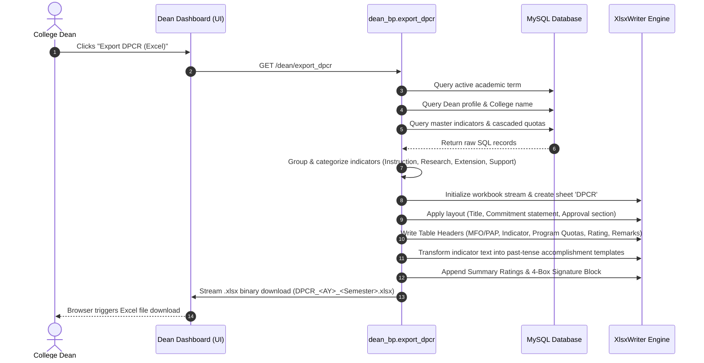

# Explanation of DPCR Printing / Exporting Mechanism for College Dean

This document details the complete end-to-end process of how the **Department Performance Commitment and Review (DPCR)** form is generated, formatted, and printed/exported to Excel for the **College Dean** in the Management-PCR system.

---

## 1. Overview & Architecture

The DPCR export mechanism dynamically compiles cascaded target quotas across all academic programs under the College and formats them into an official, standardized Excel document compliant with NEUST (Nueva Ecija University of Science and Technology) administrative requirements.

- **Trigger Source**: Dean's Executive Portal ([dean_dashboard.html](file:///c:/Users/ACER/Documents/Management-PCR/Management-PCR/app/templates/dean_dashboard.html#L48-L50)) via the **Export DPCR (Excel)** button.
- **Backend Handler**: [`export_dpcr()`](file:///c:/Users/ACER/Documents/Management-PCR/Management-PCR/app/routes/dean.py#L226-L575) route in `app/routes/dean.py`.
- **Access Control**: Protected by the `@role_required('DEAN')` Flask decorator.
- **Generation Library**: `xlsxwriter` (streams directly in memory via `io.BytesIO`).

---

## 2. End-to-End Execution Flow



---

## 3. Step-by-Step Backend Process ([dean.py](file:///c:/Users/ACER/Documents/Management-PCR/Management-PCR/app/routes/dean.py#L226-L575))

### Step 1: Active Term & Dean Profile Resolution
1. **Active Term Retrieval**: Calls `get_all_terms(cursor)` and identifies the term with `is_active == 1`. If no term is active, flashes a warning and redirects to the dashboard.
2. **Dean Profile Details**: Queries `tbl_employee_profiles` using `session['user_id']` to retrieve the Dean's first name, last name, and college name.
   - *Fallback defaults*: Dean Name = `"College Dean"`, College = `"College of Information and Communications Technology"`.

### Step 2: Database Data Fetching & Categorization
The route queries indicators and cascaded targets using SQL:
```sql
SELECT 
    mi.indicator_id, mi.indicator_description, tc.category_name,
    cq.total_target_value, cq.assigned_to_role
FROM tbl_master_indicators mi
JOIN tbl_target_categories tc ON mi.category_id = tc.category_id
LEFT JOIN tbl_cascaded_quotas cq ON mi.indicator_id = cq.indicator_id AND cq.term_id = mi.term_id
WHERE mi.term_id = %s AND (mi.is_custom = 0 OR mi.is_custom IS NULL)
ORDER BY tc.category_id, mi.indicator_id
```

The returned records are structured into an `indicators_map` and categorized into four primary DPCR functional sections:
- **Instruction** (`I. Strategic Priorities (50%)` -> `A. Instruction`)
- **Research** (`II. Core Functions (40%)` -> `A. Research`)
- **Extension** (`II. Core Functions (40%)` -> `B. Extension Services / Training Services / Technical Advisory`)
- **Support** (`III. Support Functions (10%)`)

Any custom indicators are automatically mapped into the `Support` category.

### Step 3: Excel Worksheet & Formatting Setup
An in-memory Excel workbook is initialized using `xlsxwriter.Workbook(output, {'in_memory': True})`. 
- **Font Standard**: `Times New Roman` across all cell styles to match institutional standards.
- **Column Layout (24 Columns: 0 to 23)**:
  - Columns `0-3`: MFO/PAP (Merged)
  - Columns `4-6`: Success Indicator / Target + Measure
  - Column `7`: Allocated Budget
  - Columns `8-12`: Accountable Programs (`DST`, `WST`, `NST`, `BSDS`, `RET`)
  - Columns `13-14`: Actual Accomplishments
  - Columns `15-18`: Rating (`Q1`, `E2`, `T3`, `A4`)
  - Columns `19-23`: Remarks

### Step 4: Accomplishment Text Auto-Generation
To generate standard fillable accomplishment forms, the route includes `generate_accomplishment_text(desc)`:
1. **Verb Conjugation**: Active verbs in success indicators (e.g., *prepare*, *submit*, *conduct*, *publish*, *monitor*) are converted to past tense (*Prepared*, *Submitted*, *Conducted*, *Published*, *Monitored*).
2. **Numeric Masking**: Replaces specific numeric values, timelines, and percentages with fillable blank lines (`_____`), allowing Dean/Evaluators to manually record or verify actual achievements.

### Step 5: Sheet Header & Main Body Construction
1. **Title Block**: Writes `"DEPARTMENT PERFORMANCE COMMITMENT AND REVIEW (DPCR)"`.
2. **Commitment Statement**: Dynamic text specifying that the Dean commits to deliver targets for the specified semester and academic year.
3. **Approval Header**: Placeholders for `Head of Agency` (`RHODORA R. JUGO, Ed.D.`) and `Dean`.
4. **Table Header Matrix**: Defines dual-level headers for program breakdowns (DST, WST, NST, BSDS, RET) and rating categories (Q1, E2, T3, A4).
5. **Program Quota Distribution**:
   - For **College-Wide** targets, columns 8-12 are merged across the block with the formatted target value.
   - For **Role-Specific** targets, individual quotas are assigned to their respective department columns.

### Step 6: Summary Ratings & Official Signatures
1. **Category Weighting Summary**:
   - Strategic Priorities: `50%`
   - Core Functions: `40%`
   - Support Functions: `10%`
2. **Supervisor Comments Box**: Dedicated merged block for supervisor comments and recommendations.
3. **Rating Legend**: `Legend: 1 - Quantity 2 - Efficiency 3 - Timeliness 4 - Average`.
4. **4-Box Official Sign-off Matrix**:
   - **Box 1 (Discussed with)**: Dynamic Dean signature block.
   - **Box 2 (Assessed by)**: Director, Planning and Development Office (`KENNETH L. ARMAS, PhD`).
   - **Box 3 (Reviewed by)**: Vice President for Academic Affairs (`Engr. FELICIANA P. JACOBA, EdD`).
   - **Box 4 (Final Rating by)**: Head of Agency (`RHODORA R. JUGO, Ed.D.`).

### Step 7: File Delivery
The binary stream is rewound (`output.seek(0)`) and returned to the browser using Flask's `send_file()`:
- **Download Filename**: `DPCR_<AcademicYear>_<Semester>.xlsx` (e.g., `DPCR_2025_2026_1st_Semester.xlsx`).
- **MIME Type**: `application/vnd.openxmlformats-officedocument.spreadsheetml.sheet`.

---

## 4. Key Database Tables Involved

| Table Name | Description |
| :--- | :--- |
| `tbl_academic_terms` | Identifies current active term (`term_id`, `academic_year`, `semester`). |
| `tbl_employee_profiles` | Obtains Dean's full name and designated college name. |
| `tbl_master_indicators` | Holds base indicators, target descriptions, and category associations. |
| `tbl_target_categories` | Defines category names (Instruction, Research, Extension, Support). |
| `tbl_cascaded_quotas` | Contains target quotas allocated per department role (`assigned_to_role`) or College-Wide. |

---

## 5. Summary

The Dean's DPCR print mechanism is a fully dynamic report generator that bridges database state (master indicators and program quotas) with a stylized Excel template. It automates commitment statement formatting, program target placement, past-tense accomplishment conversion, and official 4-tier sign-off blocks.
