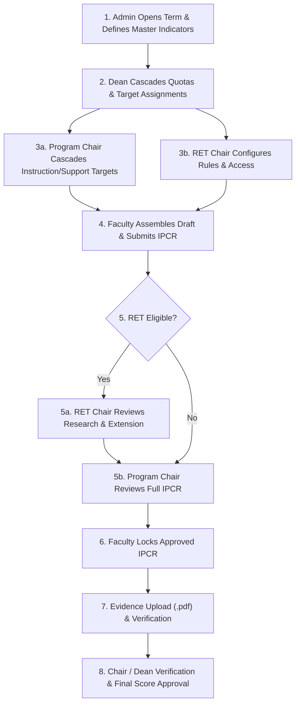

# Management-PCR System Architecture & End-to-End Workflow Documentation

This document provides a comprehensive, step-by-step breakdown of the operational flow within the **Management-PCR System**—from **Admin term initialization** and **master target setup**, to **Dean quota cascading**, **Program/RET Chair target distribution**, **Faculty target submission**, **Multi-stage approvals**, **Locking**, and **Evidence gathering file uploads**.

---

## 1. High-Level Workflow Overview

---

## 2. Detailed Phase Breakdown

### Phase 1: Academic Term Initialization & Master Indicator Setup (Admin)

#### 1.1 Roster & Account Administration
* **Routes**: `/admin/csv/import`, `/admin/faculty/save`, `/admin/faculty/toggle_status` ([admin.py](file:///c:/Users/ACER/Documents/Management-PCR/Management-PCR/app/routes/admin.py#L113-L205))
* **Actions**: 
  * Admin imports faculty roster via CSV batch import or single profile entry.
  * Unclaimed faculty members register/claim accounts via `/register` ([auth.py](file:///c:/Users/ACER/Documents/Management-PCR/Management-PCR/app/routes/auth.py#L89-L126)).
* **Verifications & Error Trapping**:
  * **CSV Validation**: Validates file presence and `.csv` extension. Decodes UTF-8 and parses headers (`employee_id_number`, `first_name`, `last_name`, `college`, `assigned_program`, `specialization`, `academic_rank`, `employment_status`, `leave_status`, `designation`).
  * **Password Policy Enforcement** (`validate_password_policy`): Minimum 8 characters, at least 1 uppercase letter, 1 lowercase letter, 1 number, 1 special character, and no spaces. Hashed using `bcrypt` (12 rounds).
  * **Account Access Check**: Validates `account_status != 'Inactive'` and `verification == 'APPROVED'` during login. Implements a 0.5-second sleep delay on authentication failure to prevent timing attacks.

#### 1.2 Academic Term Opening & Master Indicator Definition
* **Routes**: `/admin/open_term`, `/admin/indicators/add`, `/admin/indicators/import` ([admin.py](file:///c:/Users/ACER/Documents/Management-PCR/Management-PCR/app/routes/admin.py#L90-L110), [indicator.py](file:///c:/Users/ACER/Documents/Management-PCR/Management-PCR/app/models/indicator.py#L14-L70))
* **Actions**:
  * Admin opens a new term specifying `academic_year`, `semester`, and `deadline_date`.
  * Admin defines global target indicators linked to target categories (`tbl_target_categories`) stored in `tbl_master_indicators`.
* **Verifications & Error Trapping**:
  * **Transaction Integrity**: `open_new_term` deactivates all previous active terms (`UPDATE tbl_academic_terms SET is_active = FALSE`) before inserting and activating the new term (`is_active = TRUE`). Database exceptions trigger `conn.rollback()`.
  * **Baseline Filtering**: Prevents global imports from importing custom targets or baseline teaching load targets (`WHERE is_custom = 0 AND indicator_description NOT LIKE '%Teaching Load%'`).
  * **Audit Logging**: Logs sensitive operations (Term Open, CSV Import, Password Reset, Emergency Lock) to `tbl_audit_logs` with actor ID and remote IP.

---

### Phase 2: College Target Cascading (Dean)

* **Routes**: `/dean/cascade_quotas` ([dean.py](file:///c:/Users/ACER/Documents/Management-PCR/Management-PCR/app/routes/dean.py#L97-L156), [dean.py (model)](file:///c:/Users/ACER/Documents/Management-PCR/Management-PCR/app/models/dean.py#L70-L85))
* **Actions**:
  * Dean views master indicators for the active term and sets target quota values across specialization programs and roles (`WST Program`, `DST Program`, `NST Program`, `BSDS Program`, `RET / Extension`, `College-Wide`).
  * Dean directly assigns College-Wide targets to `DESIGNATED_FACULTY` members in `tbl_draft_allocation`.
* **Verifications & Error Trapping**:
  * **Term Guard**: Requires an active term (`is_active = 1`); redirects with a flash alert if none is open.
  * **Quota Validation**: Parses integer inputs and filters out non-positive values ($>0$).
  * **Transaction Safety**: Existing cascaded quotas for the active term are deleted (`DELETE FROM tbl_cascaded_quotas WHERE term_id = %s`) before inserting new quotas inside a database transaction (`commit`/`rollback`).

---

### Phase 3: Intermediate Target Distribution (Program Chair & RET Chair)

#### 3.1 Program Chair Target Cascading
* **Routes**: `/prog_chair/assign_target` ([prog_chair.py](file:///c:/Users/ACER/Documents/Management-PCR/Management-PCR/app/routes/prog_chair.py#L164-L218), [prog_chair.py (model)](file:///c:/Users/ACER/Documents/Management-PCR/Management-PCR/app/models/prog_chair.py#L82-L145))
* **Actions**:
  * Program Chair receives cascaded quotas assigned to their specialization for `A. Instructions` and `Support Functions`.
  * Program Chair inputs assigned quantities per faculty, custom descriptions, and target deadlines.
* **Verifications & Error Trapping**:
  * **Finalization Guard**: `check_chair_targets_saved` checks if targets for the specialization/term are already saved. Re-saving is blocked once targets are finalized.
  * **Role-Based Distribution Scoping**:
    * `A. Instructions` targets are cascaded to **all** active faculty under the specialization (both Regular and Designated Faculty).
    * `Support Functions` targets are cascaded to **Regular Faculty ONLY**.
  * Writes allocations into `tbl_draft_allocation`.

#### 3.2 RET Chair Target Rules & Access Control
* **Routes**: `/ret_chair/save_rule`, `/ret_chair/save_faculty_access` ([ret_chair.py](file:///c:/Users/ACER/Documents/Management-PCR/Management-PCR/app/routes/ret_chair.py#L58-L190), [ret_chair.py (model)](file:///c:/Users/ACER/Documents/Management-PCR/Management-PCR/app/models/ret_chair.py#L31-L180))
* **Actions**:
  * RET Chair manages `tbl_ret_faculty_access` to enable/disable regular faculty eligibility for RET targets.
  * RET Chair configures structural rules (`tbl_ret_rules`, `tbl_ret_rule_indicators`) establishing mandatory Research and Extension selection counts and target quantities per academic rank.
* **Verifications & Error Trapping**:
  * Overwrites existing rules per academic rank to prevent conflicts (`DELETE FROM tbl_ret_rule_indicators`).

---

### Phase 4: Draft IPCR Preparation & Submission (Faculty)

#### 4.1 Regular Faculty IPCR Submission
* **Routes**: `/faculty/submit_ipcr` ([faculty.py](file:///c:/Users/ACER/Documents/Management-PCR/Management-PCR/app/routes/faculty.py#L126-L177), [faculty.py (model)](file:///c:/Users/ACER/Documents/Management-PCR/Management-PCR/app/models/faculty.py#L192-L410))
* **Actions**:
  * **Mandatory Default Target Injection**: System automatically enforces the default `21 hours of Teaching Load` (category `A. Instructions`).
  * **Target Assembly**: Loads Program Chair cascaded targets from `tbl_draft_allocation` into `tbl_draft_targets`.
  * **RET Selection**: If RET-eligible (`is_faculty_ret_eligible`), faculty selects Research/Extension targets from the RET menu.
* **Verifications & Error Trapping**:
  * **Locking Guard**: Re-submission is rejected if targets are already committed in `tbl_committed_targets` or approved.
  * **Status Routing**:
    * Non-RET faculty bypass RET review; status advances directly to `'Waiting for Approval'` for Program Chair verification.
    * RET-eligible faculty status is set to `'Pending Review'` for RET Chair verification.
  * **Resubmission Adjustment Preservation**: If resubmitting after a return, previous custom workload adjustments by the Program Chair are preserved using `CASE WHEN ri.reviewed_quantity = ri.original_quantity THEN dt.proposed_quantity ELSE ri.reviewed_quantity END`.

#### 4.2 Designated Faculty DPCR Submission
* **Routes**: `/designated/submit_ipcr` ([designated.py](file:///c:/Users/ACER/Documents/Management-PCR/Management-PCR/app/routes/designated.py#L9-L240))
* **Actions**:
  * Automatically injects mandatory `10 hours of Teaching Load`.
  * Core cascaded instruction targets from the Program Chair remain locked (`is_locked=True`, `is_core=True`).
  * Designated faculty add custom support targets (`is_custom=1`) and submit DPCR to `tbl_draft_targets` for Dean review.

---

### Phase 5: Multi-Stage Verification & Approval Workflows

#### 5.1 Stage 1 Verification: RET Chair Review (Regular Faculty)
* **Routes**: `/ret_chair/review_ipcr/<emp_id>` ([ret_chair.py](file:///c:/Users/ACER/Documents/Management-PCR/Management-PCR/app/routes/ret_chair.py#L213-L250), [ret_chair.py (model)](file:///c:/Users/ACER/Documents/Management-PCR/Management-PCR/app/models/ret_chair.py#L181-L200))
* **Actions**:
  * RET Chair reviews Research & Extension targets in `tbl_ipcr_ret_review`.
* **Verifications & Error Trapping**:
  * **Scope Guard**: Bypasses non-RET targets. Unsubmitted drafts cannot be reviewed.
  * **Decisions**:
    * **Approve**: Header updated to `'Approved'`. RET targets in `tbl_draft_targets` advance to `'Waiting for Approval'`, unlocking Stage 2 Program Chair review.
    * **Reject**: Header updated to `'Rejected'`. Targets set to `'Returned'`.

#### 5.2 Stage 2 Verification: Program Chair Review (Regular Faculty)
* **Routes**: `/prog_chair/review_ipcr/<emp_id>` ([prog_chair.py](file:///c:/Users/ACER/Documents/Management-PCR/Management-PCR/app/routes/prog_chair.py#L224-L250), [prog_chair.py (model)](file:///c:/Users/ACER/Documents/Management-PCR/Management-PCR/app/models/prog_chair.py#L306-L525))
* **Actions**:
  * Program Chair reviews full IPCR in `tbl_ipcr_chair_review`. Can adjust reviewed quantities (`reviewed_quantity`) and enter itemized remarks (`item_remarks`).
* **Verifications & Error Trapping**:
  * **Sequential Approval Guardrail**: System evaluates dynamic status `get_overall_ipcr_status`. If RET approval is missing for RET-eligible faculty, returns HTTP `403 Forbidden` (`"RET Chair approval is required before Program Chair verification."`).
  * **Decisions**:
    * **Approve**: Header `tbl_ipcr_chair_review` set to `'Approved'`. Enables the faculty member to lock their IPCR.
    * **Reject/Return**: Header set to `'Rejected'`. Standard targets in `tbl_draft_targets` marked `'Returned'` for faculty re-submission.

#### 5.3 Stage 3 Verification: Dean Review (Designated Faculty DPCR & Final IPCR Scores)
* **Routes**: `/dean/batch_approve` ([dean.py](file:///c:/Users/ACER/Documents/Management-PCR/Management-PCR/app/routes/dean.py#L159-L188), [dean.py (model)](file:///c:/Users/ACER/Documents/Management-PCR/Management-PCR/app/models/dean.py#L87-L99))
* **Actions**:
  * Dean reviews designated faculty DPCR drafts (`tbl_ipcr_dean_review`). Approved items commit directly to `tbl_committed_targets`.
  * At term end, Dean performs batch final score approvals (`/dean/batch_approve`) on `tbl_final_scores`.

---

### Phase 6: Locking IPCR & Committing Evaluation Targets

* **Routes**: `/faculty/lock_ipcr` ([faculty.py](file:///c:/Users/ACER/Documents/Management-PCR/Management-PCR/app/routes/faculty.py#L180-L227), [prog_chair.py (model)](file:///c:/Users/ACER/Documents/Management-PCR/Management-PCR/app/models/prog_chair.py#L527-L587))
* **Actions**:
  * Faculty member locks their approved IPCR to finalize committed targets.
* **Verifications & Error Trapping**:
  * **Pre-requisite Verification**: Checks `tbl_ipcr_chair_review` header (`overall_status == 'Approved'`). Locking fails if Program Chair approval is absent.
  * **Commit Transaction**:
    1. Removes existing rows in `tbl_committed_targets` for the user & term.
    2. Inserts approved items from `tbl_draft_targets` (using reviewed quantities) into `tbl_committed_targets` (`status = 'Approved'`, `actual_quantity = 0`).
    3. Updates `tbl_draft_targets` status to `'Approved'`.

---

### Phase 7: Evidence Gathering, Upload & Verification

#### 7.1 PDF File Upload & Validation
* **Routes**: `/faculty/upload_evidence` ([faculty.py](file:///c:/Users/ACER/Documents/Management-PCR/Management-PCR/app/routes/faculty.py#L238-L304), [faculty.py (model)](file:///c:/Users/ACER/Documents/Management-PCR/Management-PCR/app/models/faculty.py#L450-L520))
* **Actions**:
  * Faculty uploads PDF evidence files per committed target in `tbl_target_evidence`.
* **Verifications & Error Trapping**:
  * **File Extension Whitelist**: Strictly enforces `.pdf` extensions (`ext in {'pdf'}`). Flash error returned on invalid extension.
  * **File Obfuscation**: Generates a random UUID prefix (`uuid.uuid4().hex_secure_filename`) to prevent file overwriting or path traversal attacks.
  * **Storage Safety**: Dynamically creates the uploads folder if missing (`os.makedirs(upload_dir, exist_ok=True)`).

#### 7.3 Evidence Verification & Evaluation Readiness
* **Routes**: `/faculty/submit_evidence`, `/prog_chair/faculty_evidence_details/<emp_id>`, `/ret_chair/faculty_evidence_details/<emp_id>` ([faculty.py](file:///c:/Users/ACER/Documents/Management-PCR/Management-PCR/app/routes/faculty.py#L97-L124), [prog_chair.py](file:///c:/Users/ACER/Documents/Management-PCR/Management-PCR/app/routes/prog_chair.py#L112-L157), [ret_chair.py](file:///c:/Users/ACER/Documents/Management-PCR/Management-PCR/app/routes/ret_chair.py#L89-L132))
* **Actions & Role-Based Access Isolation**:
  * System evaluates readiness (`check_faculty_evidence_readiness`): target is fulfilled when `actual_quantity >= assigned_quantity`.
  * **Program Chair Evidence Inspection**: Scoped strictly to `A. Instructions` and `Support Functions`. RET categories are filtered out (`is_ret = True` $\rightarrow$ empty evidence list returned).
  * **RET Chair Evidence Inspection**: Scoped strictly to `A. Research` and `B. Extension Services`. Instruction and Support categories are filtered out.

---

## 3. System-Wide Verification, Audit & Safeguard Matrix

| Protection Layer | Mechanism / Function | Error / Safeguard Action |
| :--- | :--- | :--- |
| **Role-Based Access Control** | `@role_required(role)` decorator ([decorators.py](file:///c:/Users/ACER/Documents/Management-PCR/Management-PCR/app/decorators.py#L3-L14)) | Rejects unauthorized role access with `403 Unauthorised` or redirects to login. |
| **Password Policy** | `validate_password_policy` ([auth.py](file:///c:/Users/ACER/Documents/Management-PCR/Management-PCR/app/auth.py#L13-L26)) | Rejects weak passwords without uppercase, lowercase, numbers, special characters, or $<8$ chars. |
| **Brute-Force / Timing Guard** | `time.sleep(0.5)` on authentication failure ([auth.py](file:///c:/Users/ACER/Documents/Management-PCR/Management-PCR/app/routes/auth.py#L35-L64)) | Delays response time to mitigate brute-force and timing attacks. |
| **Sequential Approval Guard** | `get_overall_ipcr_status` ([prog_chair.py](file:///c:/Users/ACER/Documents/Management-PCR/Management-PCR/app/routes/prog_chair.py#L247-L249)) | Blocks Program Chair review until RET Chair approves RET targets (`403 Forbidden`). |
| **Locking Pre-requisite Check** | `lock_and_commit_ipcr` ([prog_chair.py (model)](file:///c:/Users/ACER/Documents/Management-PCR/Management-PCR/app/models/prog_chair.py#L529-L536)) | Rejects locking if `tbl_ipcr_chair_review` header status is not `'Approved'`. |
| **Upload Format Restriction** | `.pdf` extension check ([faculty.py](file:///c:/Users/ACER/Documents/Management-PCR/Management-PCR/app/routes/faculty.py#L261-L266)) | Flash error on unsupported formats (only `.pdf` allowed). |
| **File Overwrite Protection** | `uuid.uuid4().hex` filename generation ([faculty.py](file:///c:/Users/ACER/Documents/Management-PCR/Management-PCR/app/routes/faculty.py#L273)) | Prevents file collisions or malicious file overwrite attempts. |
| **Evidence Inspection Isolation** | Category filtering in Chair evidence routes ([prog_chair.py](file:///c:/Users/ACER/Documents/Management-PCR/Management-PCR/app/routes/prog_chair.py#L139-L145), [ret_chair.py](file:///c:/Users/ACER/Documents/Management-PCR/Management-PCR/app/routes/ret_chair.py#L113-L119)) | Program Chair cannot view RET evidence; RET Chair cannot view Instruction/Support evidence. |
| **Database Transaction Safety** | `try / except / conn.rollback()` blocks across model files | Ensures multi-table database operations roll back cleanly on errors. |
| **Security Audit Trail** | `log_audit_action` ([audit.py](file:///c:/Users/ACER/Documents/Management-PCR/Management-PCR/app/models/audit.py#L1-L5)) | Records administrative actions, password resets, account locks, and CSV imports with IP address and timestamps. |
