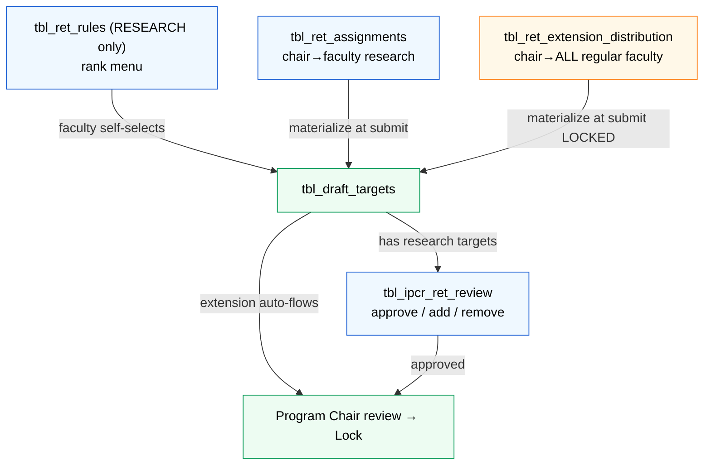

# RET Flow Redesign — Dual-Path Research + Distributed Extension

Consolidated spec for the Research, Extension & Training (RET) redesign, replacing
the earlier "RET faculty access" gate. Supersedes the R0/R1 notes discussed in-thread.

> Status legend: ✅ applied · 🔨 to build · ♻️ rework of R1 · 🗑️ remove

---

## 1. Interview outcomes (the decisions that drive this)

1. **Eligibility = everyone (Option B).** Every *regular* faculty may take Research
   targets. It is **optional** self-selection — not gated by a per-faculty enable flag.
2. **Dual *path*, not dual *mode*.** Faculty may self-select Research, **and** the RET
   Chair may assign Research — both are always available; the final set is their union.
   (The R1 SELF_SELECT/ASSIGNED per-faculty toggle is therefore redundant.)
3. **Research and Extension are different distribution models:**
   - **Research** → rank **menu**, faculty self-select (+ chair assign / review-modal add).
   - **Extension/Training/Advisory** → **blanket distribution** by the RET Chair to *all*
     regular faculty across *all* specializations (mirrors how the Program Chair
     distributes Instruction/Support, but org-wide). Not self-selectable.

### Open decisions — chosen defaults (confirm or correct)

| # | Decision | Default chosen |
|---|----------|----------------|
| D1 | Extension quantity semantics | Each regular faculty receives the **per-faculty quantity the chair sets** (like PC distribution), *not* the Dean total divided by headcount. |
| D2 | Extension storage | New term-level table **`tbl_ret_extension_distribution`** (not per-emp `tbl_draft_allocation` rows). |
| D3 | Does distributed Extension need RET review? | **No — auto-flows** to the Program Chair. Only **Research** goes through the RET review modal. |

---

## 2. Model overview

| | **Research** | **Extension / Training / Advisory** |
|---|---|---|
| Selection | Rank menu, faculty self-select (optional) | Blanket distribution to all regular faculty |
| RET Chair control | Assign per-faculty, or add/remove in review modal | Distribute once against Dean quota |
| Faculty sees | Selectable checklist | Pre-assigned, **read-only / locked** |
| Rank rules (`tbl_ret_rules`) | Yes (research only) | None |
| RET review stage | Yes | No (auto-flow) |



---

## 3. Eligibility (Option B)

- **Removed:** the per-faculty enable gate. `is_faculty_ret_eligible` no longer reads
  `tbl_ret_faculty_access.is_enabled`.
- **New rule:** regular faculty always see the Research menu (populated from their rank
  rules — may be empty). The **RET review stage** is triggered by *presence of Research
  draft targets*, not by any flag:
  - has ≥1 Research target (self-selected or chair-assigned) → routes through RET review;
  - none → bypasses RET, straight to Program Chair (today's non-eligible path).
- Extension is always distributed regardless and does **not** trigger RET review (D3).

---

## 4. Data model

### Applied in R0 ✅
- `tbl_target_categories`: `slug`, `review_lane`, `is_core`, `weight_group`, `display_order`, `is_active`.
- `tbl_ret_assignments (term_id, emp_id, indicator_id, target_quantity, assigned_by)` — **keep** (research per-faculty direct assignment).
- `tbl_ret_faculty_access.assignment_mode` — ♻️ now redundant (see below).

### New 🔨
```sql
CREATE TABLE tbl_ret_extension_distribution (
  dist_id         INT NOT NULL AUTO_INCREMENT,
  term_id         INT NOT NULL,
  indicator_id    INT NOT NULL,
  target_quantity INT NOT NULL DEFAULT 1,   -- per-faculty quantity (D1)
  distributed_by  INT NULL,                 -- RET chair emp_id
  created_at      DATETIME DEFAULT CURRENT_TIMESTAMP,
  updated_at      DATETIME DEFAULT CURRENT_TIMESTAMP ON UPDATE CURRENT_TIMESTAMP,
  PRIMARY KEY (dist_id),
  UNIQUE KEY uk_ext_dist (term_id, indicator_id),
  CONSTRAINT fk_red_term FOREIGN KEY (term_id)      REFERENCES tbl_academic_terms(term_id)   ON DELETE CASCADE,
  CONSTRAINT fk_red_ind  FOREIGN KEY (indicator_id) REFERENCES tbl_master_indicators(indicator_id) ON DELETE CASCADE
) ENGINE=InnoDB DEFAULT CHARSET=utf8mb4 COLLATE=utf8mb4_general_ci;
```

### Remove 🗑️
```sql
-- Eligibility gate (B) and assignment_mode (dual-path) are both gone, leaving the
-- access table with no remaining purpose. Direct research assignments live in
-- tbl_ret_assignments; extension in tbl_ret_extension_distribution.
DROP TABLE tbl_ret_faculty_access;
```
> If you'd rather stage it: first `ALTER TABLE tbl_ret_faculty_access DROP COLUMN is_enabled, DROP COLUMN assignment_mode;` then drop the table once code no longer references it.

### Data cleanup 🔨
- `tbl_ret_rules` / `tbl_ret_rule_indicators` become **research-only**. Existing Extension
  rules should be deleted (or ignored) so the rank menu no longer offers Extension.

---

## 5. Flows

### 5a. Research (self-select + assign)
1. Rank rules define the research menu (`tbl_ret_rules`, research only).
2. Faculty optionally self-selects on My IPCR → written to `tbl_draft_targets` at submit.
3. RET Chair may **assign directly** (`tbl_ret_assignments`, rank-menu-restricted) — materialized into the faculty's draft targets at submit.
4. RET Chair may **add/remove in the review modal** — already supported via `review_ipcr`'s `unpicked` list + `save_ret_review_items` `is_new` handling.
5. Approve/reject as today (`decide_ret_review`).

### 5b. Extension (blanket distribution)
1. RET Chair picks Extension indicator(s) + per-faculty quantity → `tbl_ret_extension_distribution` (one row per indicator, term-scoped), sourced against the Dean's `tbl_cascaded_quotas` (`assigned_to_role='RET / Extension'`).
2. At faculty submit, each distribution row is materialized into that faculty's `tbl_draft_targets` as a **locked** Extension target.
3. Faculty see Extension as read-only assigned workload; it **auto-flows** to the Program Chair (no RET review, per D3).

---

## 6. Faculty submit pipeline — the collision fix

Under B the RET branch of `submit_faculty_ipcr` always runs. Today it deletes **all**
`review_lane='RET'` draft targets and reinserts only self-selected research — which would
wipe distributed Extension.

**Fix:** scope the delete/reinsert to **Research only** (`slug='research'`). Extension is
materialized from `tbl_ret_extension_distribution` and never touched by the self-select
path (locked). Chair research assignments from `tbl_ret_assignments` are merged in the
same materialization step.

---

## 7. Component change map

| Area | File | Change |
|---|---|---|
| Eligibility | `app/models/faculty.py` `is_faculty_ret_eligible` | ♻️ regular faculty always eligible; menu = research rank rules |
| Status machine | `app/models/connection.py` `get_overall_ipcr_status` | ♻️ RET stage triggers on presence of **research** targets; no `is_enabled` |
| Submit pipeline | `app/models/faculty.py` `submit_faculty_ipcr` | ♻️ research-only delete/reinsert; materialize assignments + extension (locked) |
| Faculty menu | `app/models/faculty.py` `get_faculty_ret_menu` | ♻️ research only |
| Faculty dashboard | `app/routes/faculty.py`, `faculty_dashboard.html` | ♻️ always render research menu; show extension as locked assigned |
| Rank rules | `app/models/ret_chair.py` `save_ret_rule`, `get_ret_rules`; `ret_chair_dashboard.html` | ♻️ research-only editor |
| Extension distribution | `ret_chair.py` (model+route), `ret_chair_dashboard.html` | 🔨 new distribution UI + `save/get_ret_extension_distribution` |
| Direct research assign | `tbl_ret_assignments` + assignment editor (R1) | ♻️ keep; relocate into Target Assignment section; drop mode toggle |
| Review queue | `app/models/ret_chair.py` `get_pending_ret_draft_ipcrs` | ♻️ drop `is_enabled`; show submitted faculty (so chair can inject research) |
| Access panel | `ret_chair_dashboard.html` `nav-faculty-access`; `save_faculty_access` route; `save_faculty_ret_access` model | 🗑️ delete |

---

## 8. Re-sequenced phases

- **R0 — Schema** ✅ done (categories, `tbl_ret_assignments`, `tbl_ret_extension_distribution` added; `tbl_ret_faculty_access` dropped).
- **R1 — Direct research assignment** ✅ done + reworked (mode toggle dropped, editor relocated to Target Assignment, access panel removed).
- **R2 — Faculty pipeline** ✅ done (research-only rewrite; chair assignments materialized locked; faculty dashboard locks assigned research).
- **R3 — Eligibility/status** ✅ done (folded into the R1-rework pass — Option B in `is_faculty_ret_eligible` + research-triggered `get_overall_ipcr_status`; extension auto-flow logic in place).
- **R4 — Extension distribution** ✅ done (chair distribution UI + model/route; per-faculty materialization at submit; RET review scoped research-only; faculty read-only extension view).
- **R5 — Rank rules research-only** ✅ done (rules editor UI trimmed to Research: removed Extension count input, Extension options list, table columns, and the `editRule`/save-route Extension handling).
- **R6 — Smoke test** ✅ done — end-to-end manual test passed. Post-test fixes applied:
  - submit button no longer gated on (removed) Extension self-select; gates on Research only + initial state call;
  - distributed Extension shown read-only in the RET review modal's Submitted Targets (and removed from Unselected);
  - distributed Extension materialized as `Approved` so the Program Chair sees it RET-approved (and extension-only faculty aren't blocked).

## Still open (product decisions, non-blocking)
- Research "Required Selections" is a hard minimum; if Research should be truly optional (submit allowed with 0 picked), that's a small change.
- Extension distribution is permanently locked once done (no unlock/redo path) — add an admin reset if a safety valve is wanted.

---

## 9. What we keep vs. rework from R1

- **Keep:** `tbl_ret_assignments`, the assignment editor modal + `save_ret_assignments`
  (rank-menu-restricted), the non-destructive-save mindset.
- **Rework/remove:** `assignment_mode` column + toggle (redundant), the Faculty RET Access
  panel + `save_faculty_access` (deleted), `is_enabled` everywhere.
